# Estructura de la base de datos

Mapa completo de tablas, campos clave y relaciones del **Sistema Gestor IT**.

**Fuente:** [`GestorApp/models.py`](../../GestorApp/models.py)  
**Auth:** `django.contrib.auth.models.User` (sin `AUTH_USER_MODEL` propio)  
**ORM:** Django; nombres de tabla por defecto `gestorapp_<modeloenminusculas>`  
**Última revisión:** agosto 2026  

Documentación relacionada: `MODELS.md` (detalle narrativo), `ORGANIZACION_Y_MAPA_SEDES.md`, `RENOMBRES_MENU_Y_MODULOS.md`.

---

## Tabla de contenidos

1. [Visión general](#1-visión-general)
2. [Diagrama global de relaciones](#2-diagrama-global-de-relaciones)
3. [Leyenda on_delete](#3-leyenda-on_delete)
4. [Dominio: Auth y roles](#4-dominio-auth-y-roles)
5. [Dominio: Organización](#5-dominio-organización)
6. [Dominio: Espacios físicos](#6-dominio-espacios-físicos)
7. [Dominio: Proveedores](#7-dominio-proveedores)
8. [Dominio: Inventario de equipos](#8-dominio-inventario-de-equipos)
9. [Dominio: Asignaciones y movimientos](#9-dominio-asignaciones-y-movimientos)
10. [Dominio: Mantenimiento](#10-dominio-mantenimiento)
11. [Dominio: Soporte (tickets)](#11-dominio-soporte-tickets)
12. [Dominio: Bitácora](#12-dominio-bitácora)
13. [Dominio: Compras](#13-dominio-compras)
14. [Dominio: Consumibles](#14-dominio-consumibles)
15. [Dominio: Historial de actividad](#15-dominio-historial-de-actividad)
16. [Dominio: Gobierno](#16-dominio-gobierno)
17. [Matriz completa de FK](#17-matriz-completa-de-fk)
18. [Catálogos TextChoices](#18-catálogos-textchoices)
19. [UI vs modelo](#19-ui-vs-modelo)
20. [Índice de modelos](#20-índice-de-modelos)

---

## 1. Visión general

El esquema se organiza en **ejes**:

| Eje | Pregunta | Tablas núcleo |
|-----|----------|---------------|
| Organización | ¿Quién / qué departamento? | `Area`, `Puesto`, `Personal` |
| Espacios | ¿Dónde está físicamente? | `Edificio`, `ZonaEdificio`, `Ubicacion` |
| Inventario | ¿Qué activo es? | `CategoriaEquipo`, `Equipo` |
| Operación | ¿Quién lo tiene / qué pasó? | `AsignacionEquipo`, `MovimientoEquipo`, `Mantenimiento` |
| Soporte | ¿Qué incidente? | `TicketIT`, `SeguimientoTicket`, comentarios |
| Compras / stock | ¿Cómo se adquirió / stock cantidad? | `OrdenCompra`, `ProductoConsumible` |
| Gobierno | ¿Quién decide / suplencia? | `CoberturaTickets`, `SolicitudEquipo` |
| Auditoría | ¿Qué hizo el sistema/usuario? | `HistorialActividad` |

```text
User ──1:1── Personal ──FK── Area, Puesto, Ubicacion
                  │
                  ├── AsignacionEquipo ── Equipo
                  └── MovimientoEquipo / MovimientoStock

Edificio ── ZonaEdificio ── Ubicacion ── Equipo / ProductoConsumible / Personal

Equipo ── CategoriaEquipo
       ├── equipo_padre (kit periféricos)
       ├── Mantenimiento ──1:1── AgendaMantenimiento (cierre)
       └── TicketIT / SolicitudEquipo

OrdenCompra ── DetalleOrdenCompra ── Equipo (opcional)
            └── MovimientoStock (opcional)
```

---

## 2. Diagrama global de relaciones

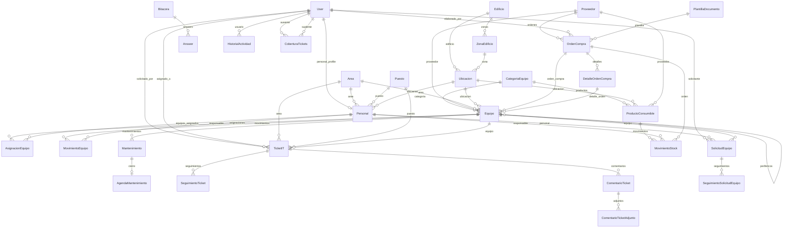

---

## 3. Leyenda on_delete

| Política | Efecto |
|----------|--------|
| `CASCADE` | Al borrar el padre, se borran los hijos |
| `PROTECT` | Impide borrar el padre si hay hijos |
| `SET_NULL` | Deja el FK en `NULL` (campo nullable) |
| `SET_NULL` + blank | Relación opcional |

---

## 4. Dominio: Auth y roles

| Tabla Django | Modelo app | Notas |
|--------------|------------|-------|
| `auth_user` | `User` | Login, flags, password |
| `auth_group` | `Group` | Roles de negocio: Usuario, Tecnico IT, Administrador |
| `auth_user_groups` | M2M | Usuario ↔ Group |

El rol **no** vive en `Personal`; vive en Groups del `User`. Ver `ROLES.md`.

---

## 5. Dominio: Organización

### `Area` (UI: Departamento)

| Campo | Tipo | Notas |
|-------|------|-------|
| `nombre_area` | CharField(100) | |
| `descripcion_area` | CharField(255) | blank/null |
| `activo` | Boolean | default True |
| `fecha_creacion` | DateTime | auto_now_add |

### `Puesto`

| Campo | Tipo | Notas |
|-------|------|-------|
| `nombre_puesto` | CharField(100) | |
| `descripcion_puesto` | CharField(255) | blank/null |
| `activo` | Boolean | default True |

### `Personal`

| Campo | Tipo | Relación | on_delete |
|-------|------|----------|-----------|
| `numero_empleado` | CharField(30) unique | — | — |
| `user` | OneToOne → User | `related_name=personal_profile` | SET_NULL |
| `admin_requested` | Boolean | Legacy | — |
| `nombre`, `apellido_*` | CharField | — | — |
| `correo`, `telefono` | opcionales | — | — |
| `area` | FK → Area | Departamento | SET_NULL |
| `puesto` | FK → Puesto | Cargo | SET_NULL |
| `ubicacion` | FK → Ubicacion | Espacio físico fijo (opcional) | SET_NULL |
| `activo` | Boolean | | |
| `fecha_ingreso` | Date | blank/null | |
| `fecha_creacion` | DateTime | auto_now_add | |

**Hijos / reverse:**

- `equipos_asignados` → `AsignacionEquipo`
- `solicitudes_equipo` → `SolicitudEquipo`
- `movimientos_stock` → `MovimientoStock`
- Movimientos de equipo vía `MovimientoEquipo.responsable`

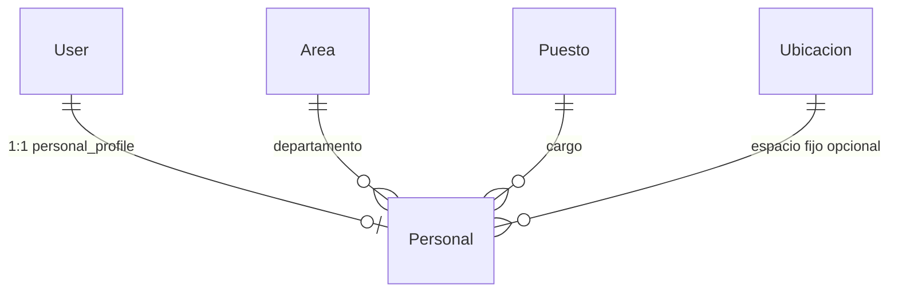

---

## 6. Dominio: Espacios físicos

Jerarquía: **Edificio → Sector (`ZonaEdificio`) → Espacio físico (`Ubicacion`)**.

### `Edificio`

| Campo | Tipo |
|-------|------|
| `nombre_edificio` | CharField(100) |
| `descripcion_edificio` | CharField(255) blank/null |
| `activo` | Boolean |

Reverse: `zonas` → `ZonaEdificio`.

### `ZonaEdificio` (UI: Sector)

| Campo | Tipo | Relación | on_delete |
|-------|------|----------|-----------|
| `edificio` | FK | Edificio | CASCADE (`related_name=zonas`) |
| `nombre_zona` | CharField(100) | | |
| `descripcion_zona` | CharField blank/null | | |
| `activo` | Boolean | | |

### `Ubicacion` (UI: Espacio físico)

| Campo | Tipo | Relación | on_delete |
|-------|------|----------|-----------|
| `edificio` | FK | Edificio | PROTECT |
| `zona` | FK | ZonaEdificio | PROTECT |
| `pasillo` | CharField blank/null | | |
| `referencia` | CharField blank/null | Identificador visible | |
| `activo` | Boolean | | |
| `es_stock_default` | Boolean indexed | Almacén por defecto (único activo vía `save`) | |

**Usado por:** `Equipo.ubicacion`, `Personal.ubicacion`, `ProductoConsumible.ubicacion`.

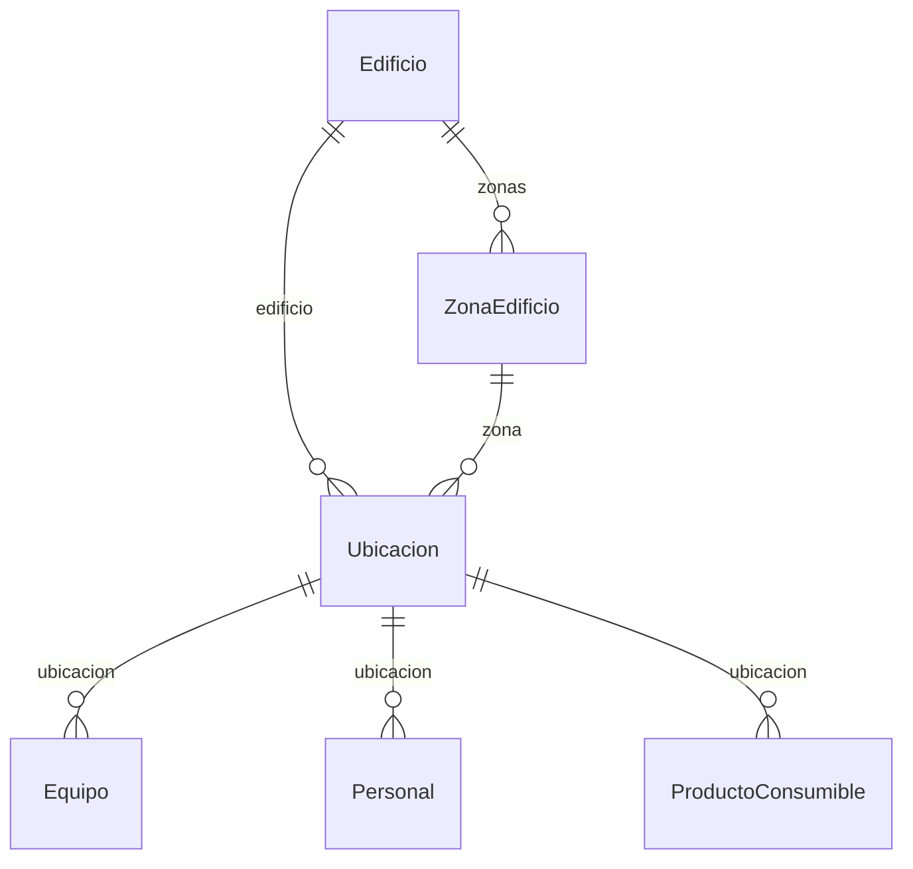

---

## 7. Dominio: Proveedores

### `Proveedor`

| Campo | Tipo | Notas |
|-------|------|-------|
| `codigo_interno` | CharField unique | Auto `PROV-######` |
| `nombre_proveedor` | CharField(150) | Comercial |
| `razon_social`, `rfc`, `tipo` | opcionales | `TipoProveedor` |
| contacto, correo, telefono, sitio_web, dirección… | opcionales | |
| `activo` | Boolean | |

Reverse: `ordenes_compra`, `productos_consumibles`; equipos vía `Equipo.proveedor`.

---

## 8. Dominio: Inventario de equipos

### `CategoriaEquipo`

| Campo | Tipo | Notas |
|-------|------|-------|
| `nombre_categoria` | CharField(100) | |
| `descripcion_categoria` | blank/null | |
| `tipo` | CharField choices | Equipo / Periferico / Herramienta / Consumible |
| `activo` | Boolean | |

### `Equipo`

| Campo | Tipo | Relación | on_delete |
|-------|------|----------|-----------|
| `codigo_inventario` | CharField unique | — | — |
| `numero_serie` | CharField unique blank/null | — | — |
| `categoria` | FK CategoriaEquipo | tipo de inventario | PROTECT |
| `marca`, `modelo`, `descripcion_equipo` | opcionales | | |
| `Numero_Pedimiento` | CharField blank/null | | |
| `imagen` | ImageField | | |
| `proveedor` | FK Proveedor | | SET_NULL |
| `origen_alta` | choices | Compra, Legado, … | |
| `orden_compra` | FK OrdenCompra | `related_name=equipos` | SET_NULL |
| `detalle_orden` | FK DetalleOrdenCompra | `related_name=equipos` | SET_NULL |
| `estado_equipo` | choices | En Stock, Asignado, En Mantenimiento, Baja | |
| `area` | FK Area | Departamento heredado al asignar | SET_NULL |
| `ubicacion` | FK Ubicacion | Espacio físico | SET_NULL |
| `equipo_padre` | FK self | Kit: solo periféricos → máquina | SET_NULL (`related_name=perifericos`) |
| `fecha_alta` / `fecha_baja` / `motivo_baja` | | | |
| `activo` | Boolean | | |
| `fecha_creacion` | DateTime | | |

**Reglas de negocio (clean):**

- Solo categoría **Periferico** puede tener `equipo_padre`.
- El padre debe ser tipo **Equipo**.
- Herramientas no se vinculan a padre.

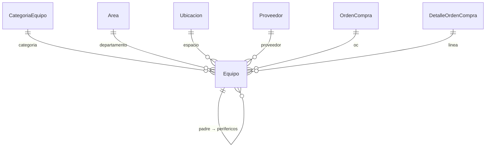

---

## 9. Dominio: Asignaciones y movimientos

### `AsignacionEquipo`

Custodia de una **máquina principal** hacia un `Personal`.

| Campo | Tipo | Relación | on_delete |
|-------|------|----------|-----------|
| `equipo` | FK | Equipo (`asignaciones`) | CASCADE |
| `personal` | FK | Personal (`equipos_asignados`) | CASCADE |
| `fecha_asignacion` | DateTime | auto_now_add | |
| `fecha_devolucion` | DateTime blank/null | | |
| `estado_asignacion` | choices | Activa / Devuelta / Extraviada | |
| `observaciones` | CharField blank/null | | |

**Mis equipos** filtra: `personal = user.personal_profile` + estado Activa + categoría tipo Equipo.

### `MovimientoEquipo`

Bitácora de cambios del activo (alta, baja, asignación, ubicación, kit…).

| Campo | Tipo | Relación | on_delete |
|-------|------|----------|-----------|
| `equipo` | FK | Equipo (`movimientos`) | CASCADE |
| `tipo_movimiento` | choices | ver §18 | |
| `fecha_movimiento` | DateTime | auto_now_add | |
| `origen`, `destino` | CharField blank/null | texto libre | |
| `responsable` | FK Personal | | SET_NULL |
| `observaciones` | CharField blank/null | | |

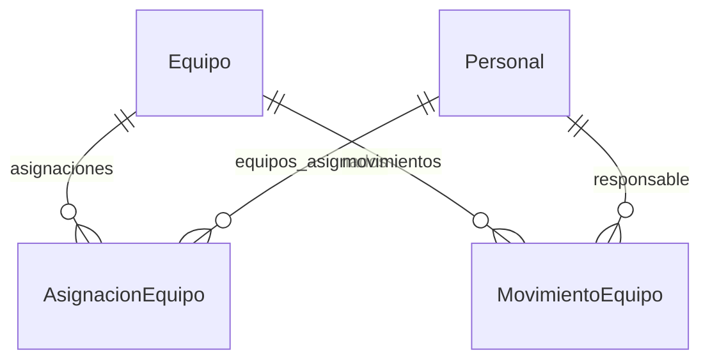

---

## 10. Dominio: Mantenimiento

### `Mantenimiento`

| Campo | Tipo | Relación | on_delete |
|-------|------|----------|-----------|
| `equipo` | FK | Equipo (`mantenimientos`) | CASCADE |
| `tipo_mantenimiento` | choices | Preventivo / Correctivo / Predictivo | |
| `estado_mantenimiento` | choices | Programado / En Proceso / Completado / Cancelado | |
| `fecha_programada` | Date | | |
| `tecnico_responsable` | CharField blank/null | texto (no FK User) | |
| `costo_mantenimiento` | Decimal | | |
| `descripcion_falla` | CharField blank/null | | |

Folio calculado: `MANxxx-mmddyy` (no es columna).

### `AgendaMantenimiento` (UI: Cierre de mantenimiento)

| Campo | Tipo | Relación | on_delete |
|-------|------|----------|-----------|
| `mantenimiento` | OneToOne | Mantenimiento (`related_name=cierre`) | CASCADE |
| `fecha_inicio`, `fecha_fin` | DateTime blank/null | | |
| `acciones_realizadas` | Text | | |
| `observaciones` | Text blank/null | | |
| `proxima_fecha_mantenimiento` | Date blank/null | alimenta calendario “ciclos” | |

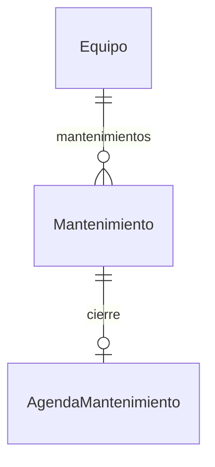

---

## 11. Dominio: Soporte (tickets)

### `TicketIT`

| Campo | Tipo | Relación | on_delete |
|-------|------|----------|-----------|
| `folio_ticket` | CharField unique | prefijo SPR0-… | |
| `requerimiento` | CharField(180) | asunto corto | |
| `area` | FK Area | `tickets_support` | SET_NULL |
| `puesto` | FK Puesto | `tickets_support_puesto` | SET_NULL |
| `solicitado_por` | FK User | `tickets_support_solicitados` | SET_NULL |
| `asignado_a` | FK User | `tickets_support_asignados` | SET_NULL |
| `equipo` | FK Equipo | opcional | SET_NULL |
| `tipo_equipo` | FK CategoriaEquipo | opcional | PROTECT |
| + estado, prioridad, tipo, fechas, imagen, etc. | | | |

### `SeguimientoTicket` (UI: Check)

| Campo | Tipo | Relación | on_delete |
|-------|------|----------|-----------|
| `ticket` | FK | TicketIT (`seguimientos`) | CASCADE |
| `folio_check` | CharField | alinea con folio del ticket | |
| `fecha_check` | DateTime | | |
| `avance_realizado`, `pendiente`, `proximo_paso` | Text | | |
| `fecha_proximo_seguimiento` | Date blank/null | evento calendario | |
| `usuario` | FK User | `checks_resueltos` | SET_NULL |
| `solucion`, `observacion` | Text | | |
| `ya_terminado` | Boolean | | |

### `ComentarioTicket` / `ComentarioTicketAdjunto`

| Modelo | Relación | on_delete |
|--------|----------|-----------|
| ComentarioTicket.ticket | TicketIT (`comentarios`) | CASCADE |
| ComentarioTicket.autor | User (`comentarios_ticket`) | SET_NULL |
| ComentarioTicketAdjunto.comentario | ComentarioTicket (`adjuntos`) | CASCADE |

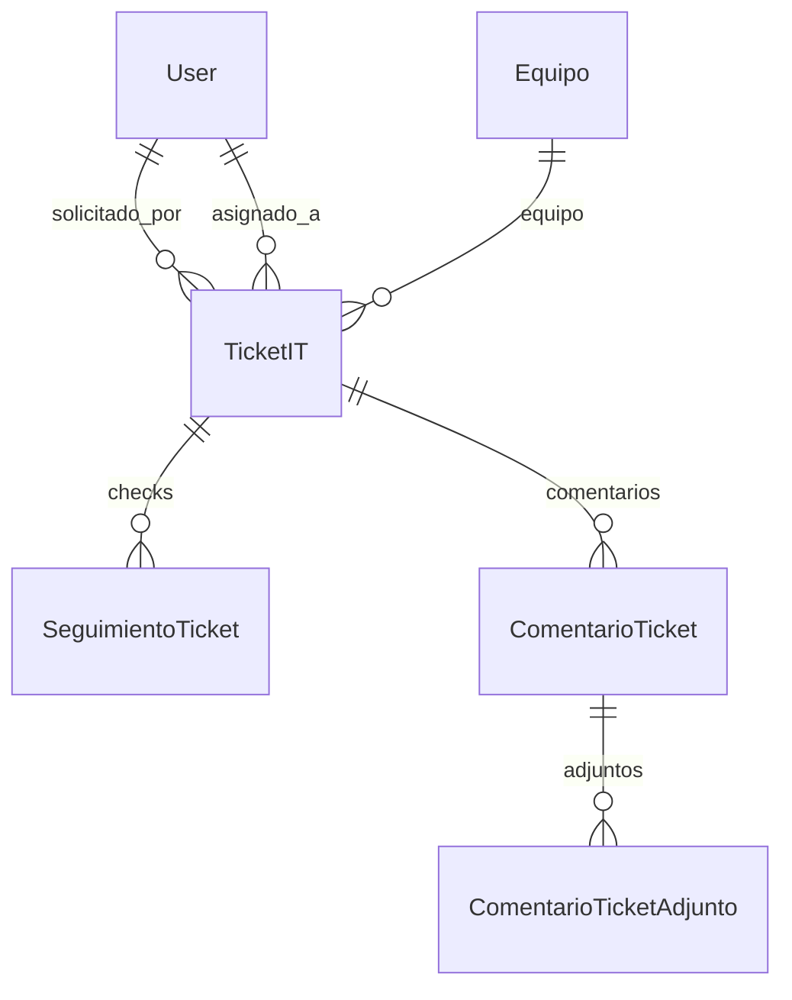

---

## 12. Dominio: Bitácora

### `Bitacora`

Registro interno (situaciones) con folio `BIT-…`. No FK obligatoria a ticket.

### `Answer`

| Campo | Relación | on_delete |
|-------|----------|-----------|
| `bitacora` | Bitacora (`answers`) | CASCADE |
| `usuario` | User (`answers_bitacora`) | SET_NULL |
| texto / fechas | | |

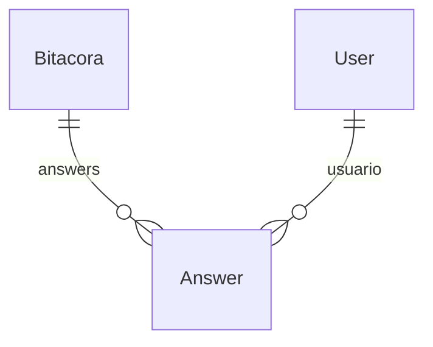

---

## 13. Dominio: Compras

### `PlantillaDocumento`

Archivo Word/Excel/PDF reutilizable; FK opcional desde `OrdenCompra.plantilla`.

### `OrdenCompra`

| Campo | Relación | on_delete |
|-------|----------|-----------|
| `folio_orden` | unique auto OC-… | |
| `elaborado_por` | User | SET_NULL |
| `proveedor` | Proveedor | SET_NULL |
| `plantilla` | PlantillaDocumento | SET_NULL |
| montos, IVA, estado, origen, PDFs… | | |

### `DetalleOrdenCompra`

| Campo | Relación | on_delete |
|-------|----------|-----------|
| `orden` | OrdenCompra (`detalles`) | CASCADE |
| descripción, cantidad, precios… | | |

Equipos pueden enlazarse a OC / línea al alta (`Equipo.orden_compra`, `Equipo.detalle_orden`).

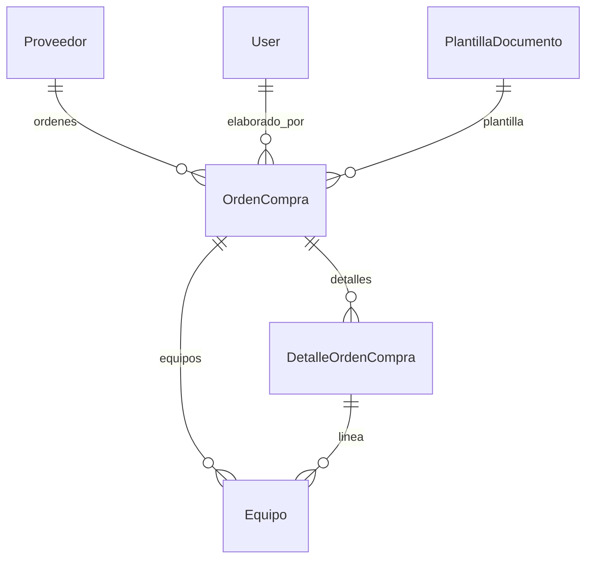

---

## 14. Dominio: Consumibles

Stock por **cantidad** (no unidad inventariable serializada).

### `ProductoConsumible`

| Campo | Relación | on_delete |
|-------|----------|-----------|
| `sku` | unique | |
| `categoria` | CategoriaEquipo tipo Consumible | PROTECT |
| `ubicacion` | Ubicacion | SET_NULL |
| `proveedor` | Proveedor | SET_NULL |
| `stock_actual`, `stock_minimo`, `unidad`, costo… | | |

### `MovimientoStock` (kardex)

| Campo | Relación | on_delete |
|-------|----------|-----------|
| `producto` | ProductoConsumible (`movimientos`) | CASCADE |
| `tipo_movimiento` | Entrada / Salida / Ajuste | |
| `cantidad`, `stock_antes`, `stock_despues` | | |
| `responsable` | Personal | SET_NULL |
| `orden_compra` | OrdenCompra | SET_NULL |
| `fecha_movimiento` | auto_now_add | |

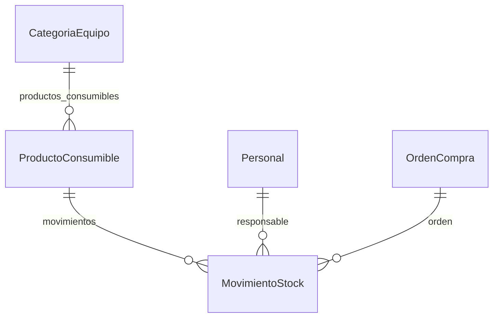

---

## 15. Dominio: Historial de actividad

### `HistorialActividad`

Registro **inmutable** (caja negra). No usa GenericFK formal: guarda tipo/id/etiqueta en texto.

| Campo | Notas |
|-------|-------|
| `fecha`, `modulo`, `accion`, `nivel` | indexed |
| `es_automatico` | sistema vs usuario |
| `usuario` | FK User SET_NULL |
| `titulo`, `descripcion` | |
| `objeto_tipo`, `objeto_id`, `objeto_etiqueta` | entidad principal |
| `entidad_relacionada_*` | contexto padre |
| `enlace_nombre`, `enlace_pk` | deep-link UI |
| `metadata` | JSON |
| `archivado`, `fecha_archivado` | retención |

No hay FK rígidas a Equipo/Ticket: es desacoplado a propósito.

---

## 16. Dominio: Gobierno

### `CoberturaTickets`

| Campo | Relación | on_delete |
|-------|----------|-----------|
| `ausente` | User | CASCADE |
| `suplente` | User | CASCADE |
| `creado_por` | User | SET_NULL |
| `fecha_inicio`, `fecha_fin`, `activa`, `motivo` | | |

### `SolicitudEquipo`

| Campo | Relación | on_delete |
|-------|----------|-----------|
| `solicitante` | User | CASCADE |
| `personal` | Personal destino | SET_NULL |
| `categoria` | CategoriaEquipo | SET_NULL |
| `revisado_por` | User | SET_NULL |
| `equipo` | Equipo asignado al decidir | SET_NULL |
| folio, título, justificación, urgencia, estado, notas… | | |

### `SeguimientoSolicitudEquipo` (legacy UI)

Tabla histórica de “Revisión IT”. La UI actual usa solo **Decision** en la solicitud; el modelo puede conservar filas antiguas.

| Campo | Relación | on_delete |
|-------|----------|-----------|
| `solicitud` | SolicitudEquipo (`seguimientos`) | CASCADE |
| `usuario` | User | SET_NULL |
| avance / pendiente / solución / `ya_terminado`… | | |

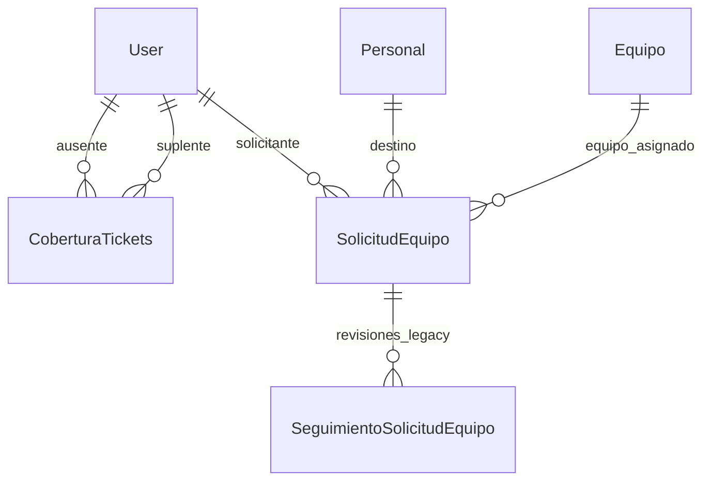

---

## 17. Matriz completa de FK

| Origen | Campo | Destino | on_delete | related_name |
|--------|-------|---------|-----------|--------------|
| Personal | user | User | SET_NULL | personal_profile |
| Personal | area | Area | SET_NULL | (default) |
| Personal | puesto | Puesto | SET_NULL | (default) |
| Personal | ubicacion | Ubicacion | SET_NULL | (default) |
| ZonaEdificio | edificio | Edificio | CASCADE | zonas |
| Ubicacion | edificio | Edificio | PROTECT | (default) |
| Ubicacion | zona | ZonaEdificio | PROTECT | (default) |
| Equipo | categoria | CategoriaEquipo | PROTECT | (default) |
| Equipo | proveedor | Proveedor | SET_NULL | (default) |
| Equipo | orden_compra | OrdenCompra | SET_NULL | equipos |
| Equipo | detalle_orden | DetalleOrdenCompra | SET_NULL | equipos |
| Equipo | area | Area | SET_NULL | (default) |
| Equipo | ubicacion | Ubicacion | SET_NULL | (default) |
| Equipo | equipo_padre | Equipo | SET_NULL | perifericos |
| MovimientoEquipo | equipo | Equipo | CASCADE | movimientos |
| MovimientoEquipo | responsable | Personal | SET_NULL | (default) |
| AsignacionEquipo | equipo | Equipo | CASCADE | asignaciones |
| AsignacionEquipo | personal | Personal | CASCADE | equipos_asignados |
| Mantenimiento | equipo | Equipo | CASCADE | mantenimientos |
| AgendaMantenimiento | mantenimiento | Mantenimiento | CASCADE | cierre (1:1) |
| TicketIT | area | Area | SET_NULL | tickets_support |
| TicketIT | puesto | Puesto | SET_NULL | tickets_support_puesto |
| TicketIT | solicitado_por | User | SET_NULL | tickets_support_solicitados |
| TicketIT | asignado_a | User | SET_NULL | tickets_support_asignados |
| TicketIT | equipo | Equipo | SET_NULL | (default) |
| TicketIT | tipo_equipo | CategoriaEquipo | PROTECT | (default) |
| SeguimientoTicket | ticket | TicketIT | CASCADE | seguimientos |
| SeguimientoTicket | usuario | User | SET_NULL | checks_resueltos |
| ComentarioTicket | ticket | TicketIT | CASCADE | comentarios |
| ComentarioTicket | autor | User | SET_NULL | comentarios_ticket |
| ComentarioTicketAdjunto | comentario | ComentarioTicket | CASCADE | adjuntos |
| Answer | bitacora | Bitacora | CASCADE | answers |
| Answer | usuario | User | SET_NULL | answers_bitacora |
| OrdenCompra | elaborado_por | User | SET_NULL | ordenes_compra_elaboradas |
| OrdenCompra | proveedor | Proveedor | SET_NULL | ordenes_compra |
| OrdenCompra | plantilla | PlantillaDocumento | SET_NULL | ordenes_compra |
| DetalleOrdenCompra | orden | OrdenCompra | CASCADE | detalles |
| ProductoConsumible | categoria | CategoriaEquipo | PROTECT | productos_consumibles |
| ProductoConsumible | ubicacion | Ubicacion | SET_NULL | productos_consumibles |
| ProductoConsumible | proveedor | Proveedor | SET_NULL | productos_consumibles |
| MovimientoStock | producto | ProductoConsumible | CASCADE | movimientos |
| MovimientoStock | responsable | Personal | SET_NULL | movimientos_stock |
| MovimientoStock | orden_compra | OrdenCompra | SET_NULL | movimientos_stock |
| HistorialActividad | usuario | User | SET_NULL | historial_actividades |
| CoberturaTickets | ausente | User | CASCADE | coberturas_como_ausente |
| CoberturaTickets | suplente | User | CASCADE | coberturas_como_suplente |
| CoberturaTickets | creado_por | User | SET_NULL | coberturas_creadas |
| SolicitudEquipo | solicitante | User | CASCADE | solicitudes_equipo |
| SolicitudEquipo | personal | Personal | SET_NULL | solicitudes_equipo |
| SolicitudEquipo | categoria | CategoriaEquipo | SET_NULL | solicitudes |
| SolicitudEquipo | revisado_por | User | SET_NULL | solicitudes_equipo_revisadas |
| SolicitudEquipo | equipo | Equipo | SET_NULL | solicitudes_origen |
| SeguimientoSolicitudEquipo | solicitud | SolicitudEquipo | CASCADE | seguimientos |
| SeguimientoSolicitudEquipo | usuario | User | SET_NULL | seguimientos_solicitud_equipo |

---

## 18. Catálogos TextChoices

| Enum | Valores |
|------|---------|
| `TipoProveedor` | Hardware, Software, Mantenimiento, Telecomunicaciones, Consumibles, Otro |
| `TipoCategoriaInventario` | Equipo, Periferico, Herramienta, Consumible |
| `EstadoEquipo` | En Stock, Asignado, En Mantenimiento, Baja |
| `OrigenAltaEquipo` | Compra, Legado, Donacion, Transferencia, Otro |
| `TipoMovimiento` | Dada de alta/baja, Asignacion, Cambio de asignacion, En mantenimiento, Cambio de ubicacion, Vincular/Desvincular/Reemplazar periferico |
| `EstadoAsignacion` | Activa, Devuelta, Extraviada |
| `TipoMantenimiento` | Preventivo, Correctivo, Predictivo |
| `EstadoMantenimiento` | Programado, En Proceso, Completado, Cancelado |
| `EstadoSupport` | Abierto, En Revision, En Proceso, Cerrado |
| `PrioridadSupport` | (según modelo tickets) |
| `UnidadConsumible` | pza, caja, ml, L, m, rollo, otro |
| `TipoMovimientoStock` | Entrada, Salida, Ajuste |
| `EstadoOrdenCompra` / `OrigenOrdenCompra` / `TipoMoneda` / `IvaOpcion` | compras |
| `ModuloHistorial` / `AccionHistorial` / `NivelHistorial` | auditoría |
| `EstadoSolicitudEquipo` | Pendiente, En revision, Aprobada, Rechazada, Completada, Cancelada |
| `UrgenciaSolicitudEquipo` | Baja, Media, Alta |

---

## 19. UI vs modelo

| Etiqueta en pantalla | Modelo / campo |
|----------------------|----------------|
| Departamento | `Area` |
| Sector | `ZonaEdificio` |
| Espacio físico | `Ubicacion` |
| Almacén / stock | `Ubicacion.es_stock_default` |
| Checks | `SeguimientoTicket` |
| Cierre de mantenimiento | `AgendaMantenimiento` |
| Movimientos de equipo | `MovimientoEquipo` |
| Historial de actividad | `HistorialActividad` |
| Cobertura de tickets | `CoberturaTickets` |
| Solicitudes de equipo | `SolicitudEquipo` |
| Mis equipos | `AsignacionEquipo` filtrado por `user.personal_profile` |

---

## 20. Índice de modelos

| Modelo | Tabla típica | Dominio |
|--------|--------------|---------|
| Area | gestorapp_area | Organización |
| Puesto | gestorapp_puesto | Organización |
| Personal | gestorapp_personal | Organización |
| Edificio | gestorapp_edificio | Espacios |
| ZonaEdificio | gestorapp_zonaedificio | Espacios |
| Ubicacion | gestorapp_ubicacion | Espacios |
| Proveedor | gestorapp_proveedor | Proveedores |
| CategoriaEquipo | gestorapp_categoriaequipo | Inventario |
| Equipo | gestorapp_equipo | Inventario |
| MovimientoEquipo | gestorapp_movimientoequipo | Inventario |
| AsignacionEquipo | gestorapp_asignacionequipo | Inventario |
| Mantenimiento | gestorapp_mantenimiento | Operaciones |
| AgendaMantenimiento | gestorapp_agendamantenimiento | Operaciones |
| TicketIT | gestorapp_ticketit | Soporte |
| SeguimientoTicket | gestorapp_seguimientoticket | Soporte |
| ComentarioTicket | gestorapp_comentarioticket | Soporte |
| ComentarioTicketAdjunto | gestorapp_comentarioticketadjunto | Soporte |
| Bitacora | gestorapp_bitacora | Soporte |
| Answer | gestorapp_answer | Soporte |
| PlantillaDocumento | gestorapp_plantilladocumento | Compras |
| OrdenCompra | gestorapp_ordencompra | Compras |
| DetalleOrdenCompra | gestorapp_detalleordencompra | Compras |
| ProductoConsumible | gestorapp_productoconsumible | Consumibles |
| MovimientoStock | gestorapp_movimientostock | Consumibles |
| HistorialActividad | gestorapp_historialactividad | Auditoría |
| CoberturaTickets | gestorapp_coberturatickets | Gobierno |
| SolicitudEquipo | gestorapp_solicitudequipo | Gobierno |
| SeguimientoSolicitudEquipo | gestorapp_seguimientosolicitudequipo | Gobierno (legacy UI) |

Más detalle de métodos, validaciones y flujos: `MODELS.md`.
