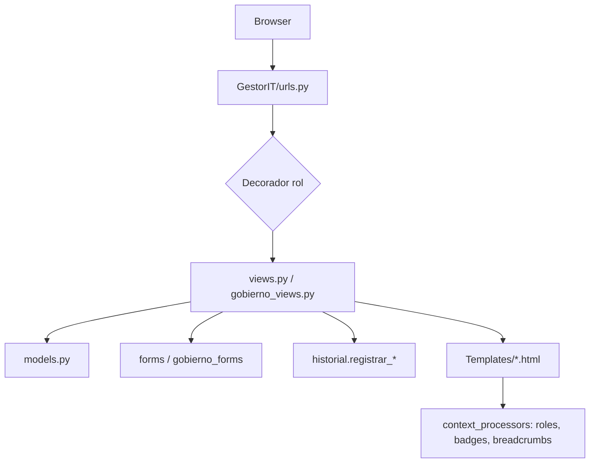
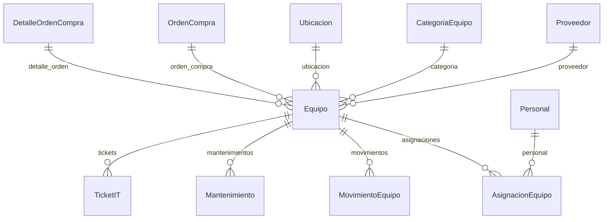
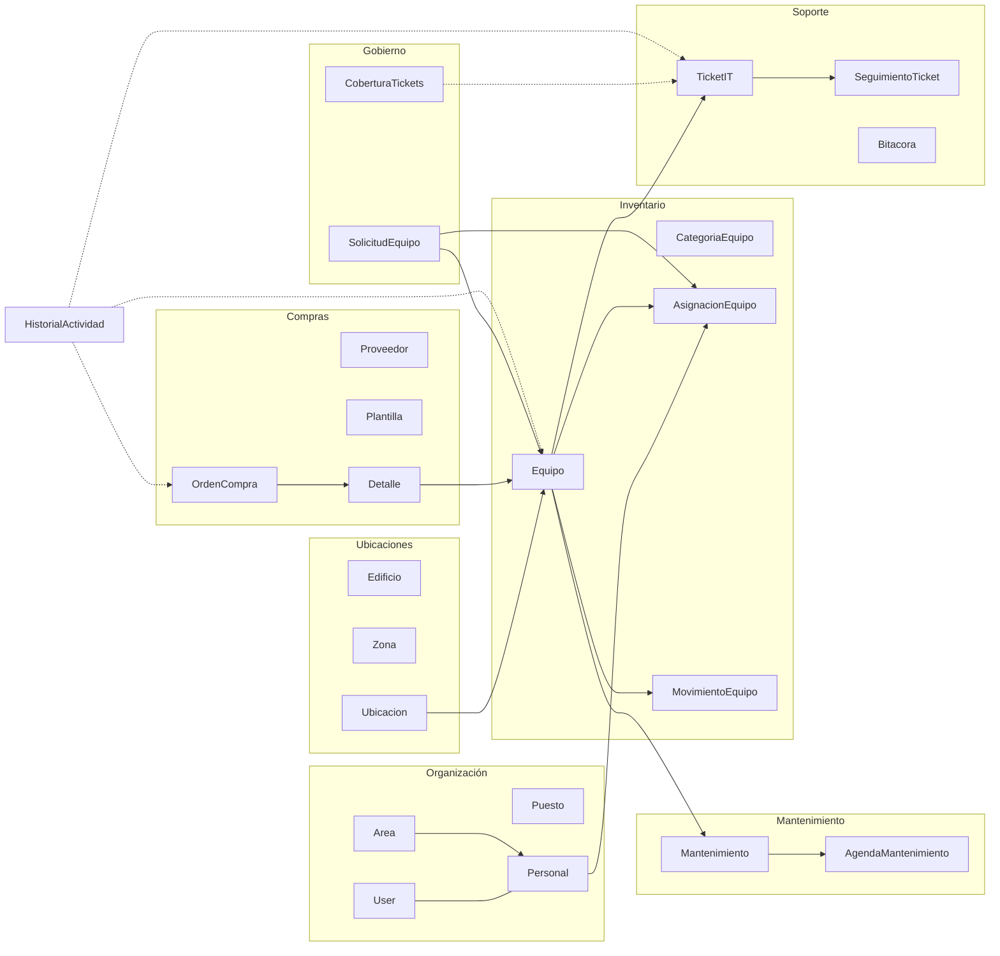
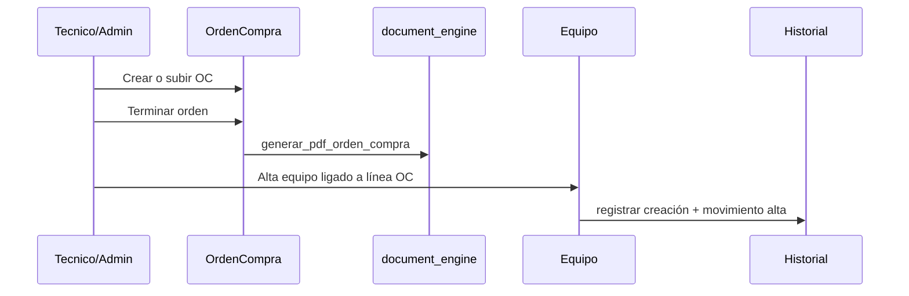

# Módulos del Sistema Gestor IT

Documentación de arquitectura funcional: qué hace cada módulo, cómo se relacionan entre sí y dónde vive el código.

---

## Tabla de contenidos

1. [Visión general](#1-visión-general)
2. [Estructura del proyecto](#2-estructura-del-proyecto)
3. [Roles y control de acceso](#3-roles-y-control-de-acceso)
4. [Módulo: Organización y personal](#4-módulo-organización-y-personal)
5. [Módulo: Ubicaciones físicas](#5-módulo-ubicaciones-físicas)
6. [Módulo: Inventario de equipos](#6-módulo-inventario-de-equipos)
7. [Módulo: Mantenimiento](#7-módulo-mantenimiento)
8. [Módulo: Soporte (tickets)](#8-módulo-soporte-tickets)
9. [Módulo: Compras y documentos](#9-módulo-compras-y-documentos)
10. [Módulo: Gobierno](#10-módulo-gobierno)
11. [Módulo: Historial y auditoría](#11-módulo-historial-y-auditoría)
12. [Infraestructura transversal](#12-infraestructura-transversal)
13. [Mapa de relaciones entre dominios](#13-mapa-de-relaciones-entre-dominios)
14. [Flujos de negocio](#14-flujos-de-negocio)
15. [Índice de archivos Python](#15-índice-de-archivos-python)

---

## 1. Visión general

**Sistema Gestor IT** es una aplicación Django monolítica para gestionar activos de tecnología, soporte, mantenimiento, compras y gobierno de roles.

| Capa | Carpeta / archivo | Rol |
|------|-------------------|-----|
| Proyecto Django | `GestorIT/` | Settings, URLs raíz, WSGI/ASGI |
| App de negocio | `GestorApp/` | Modelos, vistas, forms, templates, jobs |
| Estáticos | `static/GestorApp/` | `app.css`, `app.js` |
| Media | `media/` | Imágenes y PDFs subidos |
| CLI | `manage.py` | Migraciones, workers, comandos |

No hay múltiples apps Django de dominio: **todo el negocio vive en `GestorApp`**. Los “módulos” de este documento son **dominios funcionales**, no paquetes instalables separados.

### Roles de negocio

| Rol | Quién | Alcance típico |
|-----|-------|----------------|
| **Usuario** | Empleado final | Tickets propios, mis equipos, solicitudes, órdenes propias |
| **Tecnico IT** | Operación diaria | Inventario, tickets, mantenimiento, coberturas |
| **Administrador** | Gobierno | Personal, borrados, plantillas, retención, matriz de permisos |

Decoradores en URLs: `login_required`, `operativo_required` (Técnico + Admin), `admin_required`.

---

## 2. Estructura del proyecto

```
Sistema-Gestor-IT-R/
├── GestorIT/                 # Proyecto Django
│   ├── settings.py           # DB, cache, django-q2, media, retención
│   ├── urls.py               # Único router de toda la app
│   ├── wsgi.py / asgi.py
│   └── ...
├── GestorApp/                # Lógica de negocio
│   ├── models.py             # Todos los modelos ORM
│   ├── views.py              # CRUD y flujos operativos (~principal)
│   ├── gobierno_views.py     # Coberturas, solicitudes, matriz
│   ├── forms.py / gobierno_forms.py
│   ├── roles.py              # Roles y decoradores
│   ├── historial.py          # Auditoría + retención
│   ├── cobertura.py          # Suplencias de tickets
│   ├── document_engine.py    # Plantillas → PDF
│   ├── media_security.py     # Validación de uploads
│   ├── metrics_cache.py      # Cache de KPIs
│   ├── nav_badges.py         # Badges del menú
│   ├── job_queue.py / tasks.py / schedules.py
│   ├── Templates/            # HTML por dominio
│   └── management/commands/  # limpiar_historial, setup_background_jobs
├── static/GestorApp/
├── media/
└── documentacion/Docs1/      # ROLES.md, TICKETS.md, MANTENIMIENTO.md, …
```

### Capas de una petición típica



---

## 3. Roles y control de acceso

### Qué hace

Define tres roles con **Groups de Django** (`Usuario`, `Tecnico IT`, `Administrador`), resuelve el rol efectivo y protege vistas.

### Código clave — `GestorApp/roles.py`

| Función / constante | Explicación |
|---------------------|-------------|
| `ROLE_USUARIO`, `ROLE_TECNICO`, `ROLE_ADMIN` | Nombres de grupo |
| `ensure_role_groups()` | Crea los grupos si no existen |
| `get_user_role(user)` | Precedencia: superuser → Admin → Técnico → Usuario → fallback `is_staff` |
| `set_user_role(user, role)` | Deja un solo grupo de rol; sincroniza `is_staff` (solo Admin) |
| `is_operativo(user)` | Técnico o Admin |
| `admin_required` / `operativo_required` | Decoradores: deniegan con mensaje y redirect a `home` |
| `operativo_users_queryset()` | Usuarios que pueden atender tickets |

### Cómo se usa en URLs

En `GestorIT/urls.py` casi todas las rutas se envuelven así:

```python
path('Equipos/', views.operativo_required(views.equipo_list), name='equipo_list')
path('Personal/create/', views.admin_required(views.personal_create), name='personal_create')
path('Ticketit/', login_required(views.ticketit_list), name='ticketit_list')
```

### Context para templates — `context_processors.py`

Inyecta en cada template:

- `user_role`, `is_admin_role`, `is_tecnico_role`, `is_operativo_role`
- `breadcrumb_items`
- `nav_badges`, `nav_notifications`, `nav_notifications_total`

Detalle ampliado: ver `ROLES.md`.

---

## 4. Módulo: Organización y personal

### Qué hace

Catálogos de área/puesto y el padrón de empleados vinculados a cuentas de usuario.

### Modelos (`models.py`)

| Modelo | Campos / relaciones clave | Uso |
|--------|---------------------------|-----|
| `Area` | `nombre_area`, `activo` | Departamentos; también en tickets |
| `Puesto` | `nombre_puesto`, `activo` | Cargos; también en tickets |
| `Personal` | `numero_empleado` (unique), nombre, correo, `admin_requested`, `activo` | Perfil laboral |
| | `user` → User (**OneToOne**, `SET_NULL`) | Login ↔ persona |
| | `area` → Area, `puesto` → Puesto | Organización |

Señal `delete_user_for_personal`: al borrar `Personal`, elimina el `User` ligado.

### Vistas y URLs

| Prefijo | Acceso | Funciones |
|---------|--------|-----------|
| `/Areas/` | operativo / delete admin | CRUD área |
| `/Puestos/` | operativo / delete admin | CRUD puesto |
| `/Personal/` | list/detail operativo; create/update/delete admin | CRUD + detalle |
| `/Personal/solicitudes-admin/` | admin | Gestión de elevación |
| `/Personal/quitar-admin/` | admin | Bajar roles |

### Relación con otros módulos

- **Asignación de equipos** apunta a `Personal`.
- **Tickets** usan `Area`/`Puesto` y el `User` del solicitante.
- **Solicitud de equipo** puede ligarse a `Personal`.
- El rol del sistema se edita desde el formulario de Personal (`set_user_role`).

---

## 5. Módulo: Ubicaciones físicas

### Qué hace

Jerarquía espacial donde se colocan los equipos.

```
Edificio
  └── ZonaEdificio
        └── Ubicacion (pasillo / referencia)
```

### Modelos

| Modelo | Relaciones |
|--------|------------|
| `Edificio` | Independiente |
| `ZonaEdificio` | FK `edificio` (`CASCADE`, `related_name='zonas'`) |
| `Ubicacion` | FK `edificio` + FK `zona` (`PROTECT`) |

### Código / UX

- Formulario: `UbicacionForm` en `forms.py` (filtra zonas por edificio).
- Endpoint AJAX: `ubicacion_zona_choices` → `/Ubicacion/zonas/`.
- `Equipo.ubicacion` y la acción `equipo_cambiar_ubicacion` consumen este módulo.

---

## 6. Módulo: Inventario de equipos

### Qué hace

Núcleo del sistema: catálogo de activos, estados, asignaciones a personas y movimientos de ciclo de vida. También proveedores y categorías.

### Modelos

#### Catálogos

| Modelo | Notas |
|--------|-------|
| `CategoriaEquipo` | Tipo de activo (laptop, monitor, etc.) |
| `Proveedor` | `codigo_interno` auto `PROV-######`, RFC, `TipoProveedor`, contacto |

#### Equipo

`Equipo` es el activo central:

| Campo / propiedad | Significado |
|-------------------|-------------|
| `codigo_inventario`, `numero_serie` | Identidad |
| `categoria`, `proveedor`, `ubicacion` | Clasificación y lugar |
| `origen_alta` | Compra / Legado / Donación / Transferencia / Otro |
| `orden_compra`, `detalle_orden` | Trazabilidad a compras |
| `estado_equipo` | En Stock / Asignado / En Mantenimiento / Baja |
| `asignacion_activa` | Última asignación Activa |
| `puede_asignarse`, `puede_devolver`, `puede_dar_de_baja`, … | Reglas de negocio en propiedades |

#### Movimientos y asignaciones

| Modelo | Relación | Uso |
|--------|----------|-----|
| `MovimientoEquipo` | FK `equipo`, FK `responsable` → Personal | Eventos: alta, baja, asignación, ubicación, mantenimiento |
| `AsignacionEquipo` | FK `equipo`, FK `personal` | Quién tiene el equipo (`Activa` / `Devuelta` / `Extraviada`) |

`TipoMovimiento`: Dada de alta, Dada de baja, Asignación, Cambio de asignación, En mantenimiento, Cambio de ubicación.

### Vistas principales

| URL name | Qué hace |
|----------|----------|
| `equipo_list` / `equipo_detail` / CRUD | Inventario operativo |
| `equipo_dashboard` | KPIs e alertas |
| `mis_equipos` | Vista del usuario final (login) |
| `equipo_asignar` / `equipo_devolver` | Ciclo asignación |
| `equipo_cambiar_ubicacion` | Mueve ubicación + movimiento |
| `equipo_dar_baja` / `equipo_reactivar` | Baja lógica (admin) |
| `movimientoequipo_*` | CRUD + `registros` |
| `asignacionequipo_*` | CRUD de asignaciones |
| `movimientoequipo_list` | También alimenta la vista de auditoría vía historial |

### Relación con otros módulos



---

## 7. Módulo: Mantenimiento

### Qué hace

Planifica y ejecuta mantenimientos preventivos/correctivos/predictivos sobre un equipo, con cierre documentado.

### Modelos

| Modelo | Rol |
|--------|-----|
| `Mantenimiento` | Orden de trabajo: tipo, estado, fecha, técnico, costo, falla |
| `AgendaMantenimiento` | **OneToOne** `mantenimiento` (`related_name='cierre'`): fechas reales, acciones, próxima fecha |

### Máquina de estados (`Mantenimiento`)

Estados: `Programado` → `En Proceso` → `Completado` | `Cancelado`.

Métodos en el modelo (lógica de negocio embebida):

| Método | Condición | Efecto |
|--------|-----------|--------|
| `iniciar()` | Solo Programado | → En Proceso |
| `cancelar()` | Programado o En Proceso | → Cancelado |
| `marcar_completado()` | Tras cierre | → Completado |
| `reabrir()` | Completado o Cancelado | → En Proceso o Programado |

Las vistas `mantenimiento_iniciar` / `cancelar` / `reabrir` sincronizan además el `estado_equipo` (p. ej. “En Mantenimiento”).

### URLs

- `/MantenimientoEquipos/` + dashboard, detail, transiciones
- `/AgendaMantenimiento/` — cierres OneToOne

Documentación operativa adicional: `MANTENIMIENTO.md`.

---

## 8. Módulo: Soporte (tickets)

### Qué hace

Mesa de ayuda: tickets con folio, prioridad/SLA, asignación a técnicos, seguimientos (“checks”) y bitácora operativa.

### Modelos

| Modelo | Rol |
|--------|-----|
| `TicketIT` | Ticket: folio `SPR0-######`, requerimiento, tipo/subtipo, prioridad, status, imagen |
| `SeguimientoTicket` | Avance, pendiente, próximo paso, solución, `ya_terminado` |
| `Bitacora` | Registro operativo aparte (folio `BIT-…`) |
| `Answer` | Respuestas ligadas a bitácora |

Relaciones de `TicketIT`:

- `solicitado_por` / `asignado_a` → User
- `area` / `puesto` → organización
- `equipo` → Equipo (opcional)
- `tipo_equipo` → CategoriaEquipo

### SLA

Definido en `models.py` como `SLA_HORAS_POR_PRIORIDAD`. Propiedades del ticket:

- `sla_horas_objetivo`, `sla_fecha_limite`
- `sla_vencido`, `sla_estado` (`ok` / `proximo` / `vencido` / `cerrado`)

### Flujo de status

- Abierto → (opcional) En revisión → Cerrado
- Los seguimientos recalculan status vía `refresh_status_from_followups()` (si algún check marca `ya_terminado`, cierra).
- Acciones: `ticketit_marcar_revision`, `ticketit_reabrir`.

### Visibilidad por rol

Helpers en `views.py` (concepto):

- Usuario: ve/edita lo suyo
- Operativo: ve operación completa
- Coberturas (`cobertura.py`): el suplente ve tickets `asignado_a` de los ausentes que cubre

```python
# cobertura.py — idea central
def ticket_asignados_q_for_user(user, on_date=None):
    covered = user_ids_covered_by(user, on_date=on_date)
    q = Q(asignado_a=user)
    if covered:
        q |= Q(asignado_a_id__in=covered)
    return q
```

### Forms

`TicketITForm`, `SeguimientoTicketForm`, `AnswerForm` en `forms.py` (subtipos dinámicos, asignación de equipo del solicitante, etc.).

Detalle: `TICKETS.md`.

---

## 9. Módulo: Compras y documentos

### Qué hace

Órdenes de compra (creadas en sistema o subidas), líneas de detalle, plantillas DOCX/XLSX/PDF y generación de PDF final.

### Modelos

| Modelo | Rol |
|--------|-----|
| `PlantillaDocumento` | Archivo plantilla + `campos` JSON + tipo |
| `OrdenCompra` | Folio `OC-######`, origen CREADO/SUBIDO, moneda/IVA, totales, estado, PDF |
| `DetalleOrdenCompra` | Líneas: descripción, cantidad, precios; `related_name='detalles'` |

Helpers típicos en `OrdenCompra` / detalle: `lista_para_inventario`, `puede_recibir_equipos`, `cantidad_disponible()`.

### Motor de documentos — `document_engine.py`

| Función | Qué hace |
|---------|----------|
| `detectar_campos(archivo, tipo)` | Extrae placeholders de DOCX/XLSX/PDF |
| `generar_pdf(plantilla, valores)` | Rellena y convierte a PDF |
| `valores_desde_orden(orden)` | Mapa de campos desde una OC |
| `generar_pdf_orden_compra(orden)` | PDF final de la orden |
| `render_preview_pdf` / `workbook_a_html` | Previsualización |

Conversión Office → PDF vía LibreOffice (`soffice`) cuando aplica.

### URLs de flujo

1. `/OrdenesCompra/nueva/` — elegir crear o subir  
2. `/OrdenesCompra/crear/` o `/subir/`  
3. `/OrdenesCompra/<pk>/terminar/` — cierra y genera PDF  
4. `/OrdenesCompra/preview/` — preview  
5. `/Plantillas/` — solo Admin  

### Puente a inventario

Al dar de alta un `Equipo` se puede enlazar `orden_compra` + `detalle_orden`, consumiendo cantidad disponible de la línea.

---

## 10. Módulo: Gobierno

### Qué hace

Gobierno de acceso y procesos de solicitud/cobertura sin mezclarlo con el CRUD operativo de `views.py`.

### Archivos

| Archivo | Contenido |
|---------|-----------|
| `gobierno_views.py` | Vistas de matriz, coberturas, solicitudes |
| `gobierno_forms.py` | `CoberturaTicketsForm`, `SolicitudEquipoForm`, `SolicitudEquipoRevisionForm` |
| `cobertura.py` | Queries de coberturas vigentes |
| `permissions_matrix.py` | Matriz estática documentada (`PERMISSION_MATRIX`) |

### Modelos

#### `CoberturaTickets`

Delegación temporal: técnico **ausente** → **suplente**, con rango de fechas y flag `activa`.

Efecto: los tickets asignados al ausente aparecen como “asignados a mí” para el suplente (vía `ticket_asignados_q_for_user`).

#### `SolicitudEquipo`

Flujo: usuario pide equipo (folio `SOL-######`) → IT revisa → aprueba / asigna stock / rechaza / cancela.

Estados (`EstadoSolicitudEquipo`) y urgencia (`UrgenciaSolicitudEquipo`). Puede ligar `personal`, `categoria`, `equipo`.

Función interna relevante: `_asignar_equipo_desde_solicitud` (crea/actualiza asignación e historial).

### URLs

| Ruta | Acceso |
|------|--------|
| `/Gobierno/permisos/` | Admin — matriz documentada |
| `/Gobierno/coberturas/` | Operativo |
| `/SolicitudesEquipo/` | Login; revisar = operativo |

---

## 11. Módulo: Historial y auditoría

### Qué hace

Registro transversal de “quién hizo qué” en cada módulo, con retención (activo → archivo → purga).

### Modelo `HistorialActividad`

Campos típicos: `modulo`, `accion`, `nivel`, `es_automatico`, `usuario`, título/descripción, tipo/id/etiqueta de objeto, enlaces, `metadata` JSON, `archivado` / `fecha_archivado`.

Enums: `ModuloHistorial`, `AccionHistorial`, `NivelHistorial`.

### API — `historial.py`

| Función | Uso |
|---------|-----|
| `registrar_historial(...)` | Evento genérico |
| `registrar_creacion` / `registrar_actualizacion` / `registrar_eliminacion` | Atajos desde vistas |
| `metadata_desde_formulario(form)` | Diff de campos para auditoría |
| `archivar_historial` / `purgar_historial` / `aplicar_retencion` | Política de retención |

### UI y jobs

- Lista de auditoría: integrada en movimiento/historial (`movimientoequipo_list` + `historial_actividad_detail`)
- Admin: `/Admin/historial-retencion/`
- Command: `python manage.py limpiar_historial [--dry-run] [--async]`
- Job diario: `task_aplicar_retencion` (django-q2)

Config: `HISTORIAL_RETENCION` en `settings.py`.

---

## 12. Infraestructura transversal

Estos no son “módulos de negocio”, pero sostienen a todos los anteriores.

### 12.1 Cache de métricas — `metrics_cache.py` + `nav_badges.py`

- KPIs del home y badges del sidebar se cachean ~45 s por usuario (`METRICS_CACHE_TTL`).
- `get_or_set_user_metric` / `invalidate_metrics_cache` (versión global).
- `build_nav_badges` / `build_nav_notifications`: SLA vencidos, mantenimientos, solicitudes, etc.

### 12.2 Jobs en background — `job_queue.py`, `tasks.py`, `schedules.py`

| Pieza | Rol |
|-------|-----|
| `enqueue(...)` | Encola en django-q2 o ejecuta sync (fallback) |
| `task_aplicar_retencion` | Archiva/purga historial |
| `task_recordatorios_operativos` | Avisos SLA/mant. (fingerprint en cache) |
| `ensure_default_schedules` | Schedules diario ~02:00 y cada 15 min (post_migrate) |

Arranque worker: `python manage.py qcluster`.

### 12.3 Seguridad de media — `media_security.py`

- Valida extensión, tamaño, magic bytes / MIME.
- Nombres de archivo opacos (`SafeUploadTo`, `equipo_imagen_upload_to`, etc.).
- Límites en `MEDIA_UPLOAD` (`settings.py`).

### 12.4 Breadcrumbs — `breadcrumbs.py`

Mapa `_MODULE` por `url_name` → migas de pan en `base.html`.

### 12.5 Apps / arranque — `apps.py`

Conecta schedules de django-q2 tras migrar.

### 12.6 Tests — `tests.py`

Suites de humo: auth, flujo crítico, auditoría, hardening de media.

---

## 13. Mapa de relaciones entre dominios



### Dependencias conceptuales (quién necesita a quién)

| Dominio | Depende de |
|---------|------------|
| Personal | Area, Puesto, User |
| Ubicacion | Edificio, Zona |
| Equipo | Categoría, Proveedor?, Ubicación?, OC? |
| Asignación / Movimiento | Equipo, Personal |
| Mantenimiento | Equipo |
| Ticket | User, Area?, Equipo?, Categoría? |
| Cobertura | Users operativos |
| Solicitud | User, Personal?, Categoría?, Equipo? |
| OrdenCompra | User, Proveedor?, Plantilla? |
| Historial | Cualquier módulo (eventos) |

---

## 14. Flujos de negocio

### 14.1 Alta de activo desde compra



### 14.2 Asignación a empleado

1. Equipo en estado asignable (`puede_asignarse`).
2. `equipo_asignar` → `AsignacionEquipo` Activa + estado “Asignado” + `MovimientoEquipo`.
3. Usuario ve el equipo en `/Equipos/mis/`.
4. `equipo_devolver` cierra la asignación.

### 14.3 Solicitud de equipo (gobierno)

1. Usuario crea `SolicitudEquipo`.
2. Operativo revisa (`solicitud_equipo_revisar`).
3. Puede asignar un equipo en stock → misma lógica de asignación + historial.
4. Usuario puede cancelar si aún está pendiente.

### 14.4 Ticket de soporte

1. Cualquier usuario autenticado abre ticket (`TicketITForm`).
2. Operativo asigna técnico / marca en revisión.
3. Seguimientos actualizan avance; `ya_terminado` cierra.
4. Cobertura vigente hace visibles tickets del ausente al suplente.
5. Recordatorios SLA pueden dejar evento automático en historial (job cada 15 min).

### 14.5 Mantenimiento

1. Programar `Mantenimiento` sobre un `Equipo`.
2. `iniciar` → equipo “En Mantenimiento”.
3. Crear `AgendaMantenimiento` (cierre) → completar.
4. Opcional: programar próximo ciclo con `proxima_fecha_mantenimiento`.

---

## 15. Índice de archivos Python

| Archivo | Responsabilidad |
|---------|-----------------|
| `GestorIT/settings.py` | Config global: DB, cache, Q_CLUSTER, media, retención |
| `GestorIT/urls.py` | Todas las rutas HTTP |
| `GestorApp/models.py` | Modelos y enums de todos los dominios |
| `GestorApp/views.py` | Vistas CRUD y flujos operativos (inventario, tickets, OC, etc.) |
| `GestorApp/gobierno_views.py` | Matriz, coberturas, solicitudes de equipo |
| `GestorApp/forms.py` | Forms compartidos (ticket, ubicación, registro…) |
| `GestorApp/gobierno_forms.py` | Forms de gobierno |
| `GestorApp/roles.py` | Roles, helpers, decoradores |
| `GestorApp/cobertura.py` | Coberturas vigentes y Q de tickets |
| `GestorApp/permissions_matrix.py` | Matriz documental de permisos |
| `GestorApp/historial.py` | Auditoría y retención |
| `GestorApp/document_engine.py` | Plantillas y PDF de órdenes |
| `GestorApp/media_security.py` | Validación y paths seguros de uploads |
| `GestorApp/metrics_cache.py` | Cache versionado de métricas |
| `GestorApp/nav_badges.py` | Badges y notificaciones del menú |
| `GestorApp/job_queue.py` | Encolado con fallback sync |
| `GestorApp/tasks.py` | Tareas del worker |
| `GestorApp/schedules.py` | Schedules por defecto |
| `GestorApp/breadcrumbs.py` | Migas de pan |
| `GestorApp/context_processors.py` | Context global de templates |
| `GestorApp/apps.py` | Config de app + hook post_migrate |
| `GestorApp/tests.py` | Tests de humo y hardening |
| `management/commands/limpiar_historial.py` | CLI retención |
| `management/commands/setup_background_jobs.py` | Alta/ejecución de jobs |

### Templates por dominio (`GestorApp/Templates/`)

| Carpeta | Dominio |
|---------|---------|
| `area/`, `puesto/`, `personal/` | Organización |
| `edificio/`, `zonaedificio/`, `ubicacion/` | Ubicaciones |
| `categoriaequipo/`, `proveedor/`, `equipo/`, `movimientoequipo/`, `asignacionequipo/` | Inventario |
| `mantenimiento/`, `agendamantenimiento/` | Mantenimiento |
| `ticketit/`, `seguimientoticket/`, `bitacora/`, `answer/` | Soporte |
| `ordencompra/`, `plantilladocumento/` | Compras |
| `gobierno/` | Matriz, coberturas, solicitudes |
| `historial/` | Retención y detalle de auditoría |
| `partials/` | Headers, empty state, breadcrumbs, acciones |

---

## Documentación relacionada

| Documento | Enfoque |
|-----------|---------|
| `CASOS_DE_USO.md` | Que puede hacer cada actor en cada modulo |
| `ROLES.md` | Roles, precedencia, matriz de acceso |
| `TICKETS.md` | Flujo y SLA de tickets |
| `MANTENIMIENTO.md` | Operación de mantenimientos |
| `MEJORAS_CALIDAD_Y_GOBIERNO.md` | Cache, jobs, auditoría, media, coberturas, solicitudes |
| `MODELS.md` | Nota: puede describir un esquema anterior; la fuente de verdad actual es `GestorApp/models.py` |

---

*Generado a partir del código actual del repositorio (GestorApp + GestorIT).*
