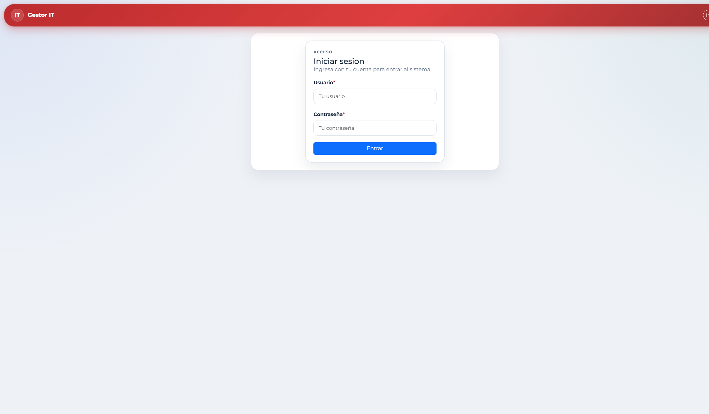

# 4. Entrar y salir

1. Abra la dirección web del sistema que le haya indicado TI.
2. Escriba su usuario y su contraseña.
3. Pulse **Entrar**. Al entrar verá Inicio, con la información que corresponde a su rol.
4. Para salir, use la opción de cerrar sesión del encabezado.

**Si no tiene cuenta.** La pantalla de registro público está desactivada. Pida el alta a un Administrador. No comparta su contraseña. Cada movimiento relevante queda a nombre de la cuenta que lo hizo.

Si intenta abrir una pantalla sin haber iniciado sesión, el sistema lo regresa al acceso.
