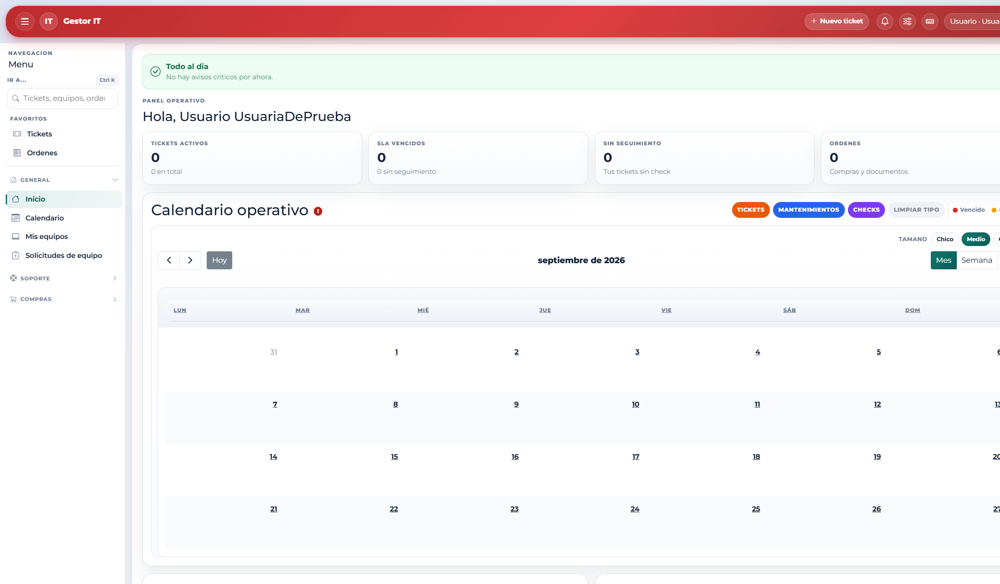

# 5. Cómo está organizada la pantalla

Después de entrar, la ventana se divide en encabezado, menú lateral y área de trabajo. Esta captura es el **Inicio** con el rol Usuario.

## Encabezado

- Gestor IT regresa a Inicio.
- El botón de la izquierda muestra u oculta el menú. En una pantalla angosta el menú se abre encima del contenido.
- Nuevo ticket crea un ticket desde cualquier pantalla.
- Nuevo equipo aparece solo para Técnico IT y Administrador.
- La campana lista los avisos pendientes y lleva al listado filtrado.
- Preferencias (icono de controles) cambia la apariencia, la densidad de las tablas y si el menú abre expandido o recogido.
- Desde el nombre de la cuenta se cierra la sesión.

## Menú lateral

- Ir a… (Ctrl+K) busca un módulo por nombre.
- Favoritos guarda los enlaces que usted fija con la chincheta.
- Recientes muestra las últimas pantallas visitadas.
- Cada sección se puede plegar. El número de color junto a un enlace es un conteo de pendientes.

El tema oscuro, la densidad compacta y los favoritos se guardan en ese navegador. Si cambia de equipo, hay que volver a elegirlos.
