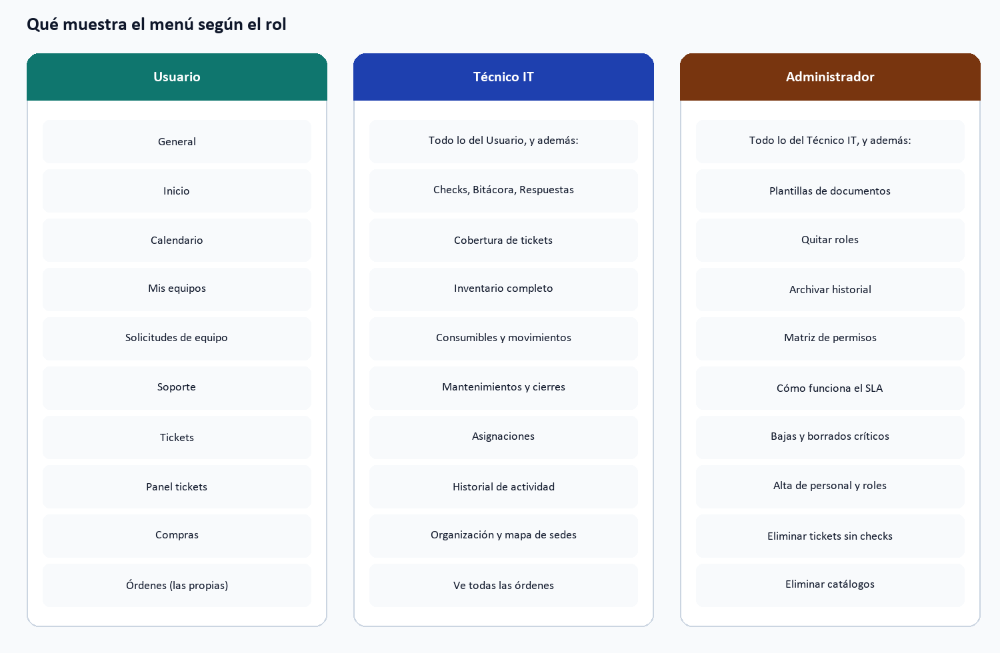
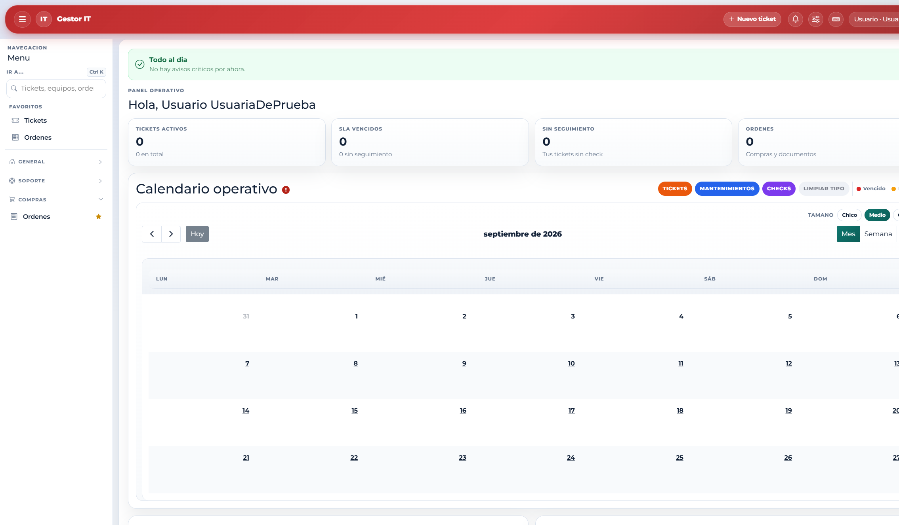
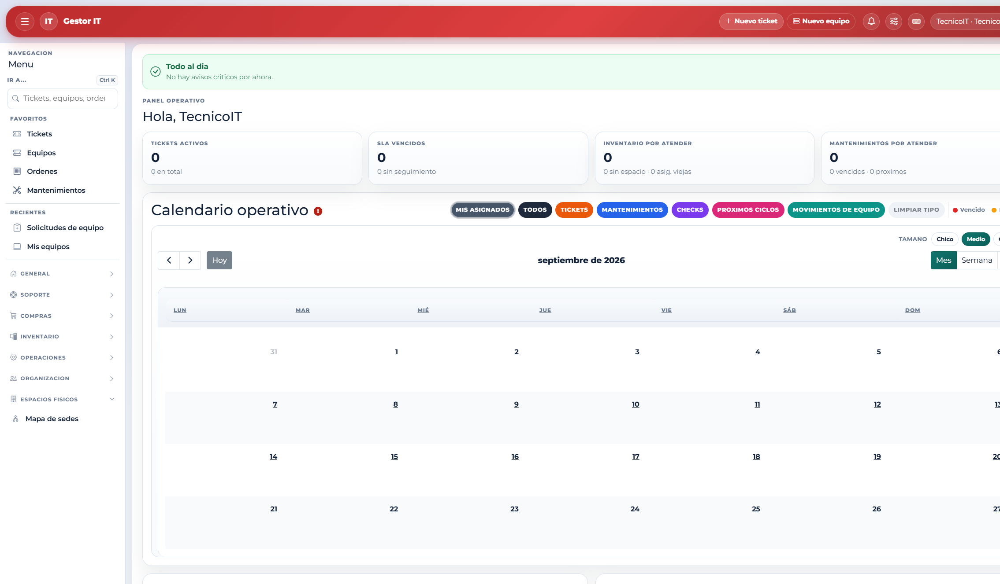
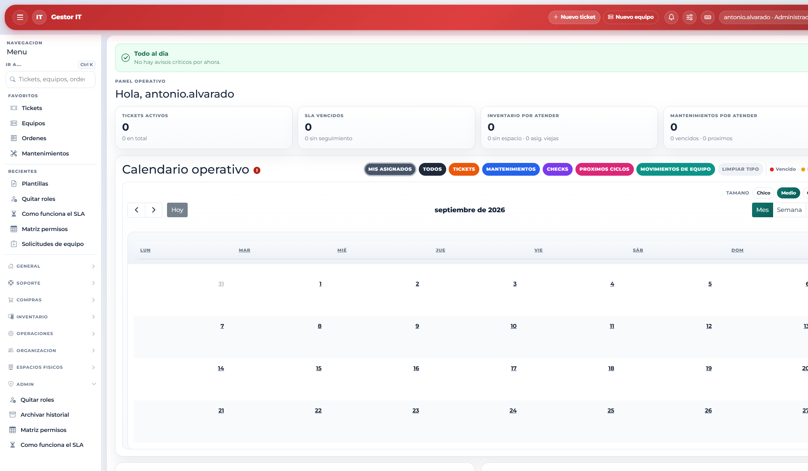

# 6. El menú según el rol

El Usuario trabaja en autoservicio. Técnico IT opera el inventario y la mesa de ayuda. El Administrador ve además el bloque de gobierno.

## Comparación resumida

| Sección | Usuario | Técnico IT | Administrador |
|---------|---------|------------|---------------|
| General | Sí | Sí | Sí |
| Tickets y panel | Sí, los propios | Sí, todos | Sí, todos |
| Checks, bitácora, respuestas, cobertura | No | Sí | Sí |
| Órdenes de compra | Las propias | Todas | Todas |
| Plantillas | No | No | Sí |
| Inventario, consumibles, mantenimiento | No | Sí | Sí |
| Organización y mapa de sedes | No | Sí | Sí |
| Quitar roles, archivar, matriz, guía SLA | No | No | Sí |

## Capturas reales del menú

Menú del rol Usuario (General, Soporte y Compras):

Menú del rol Técnico IT (incluye Inventario, Operaciones, Organización y Espacios físicos):

Menú del rol Administrador (incluye además el bloque Admin):

