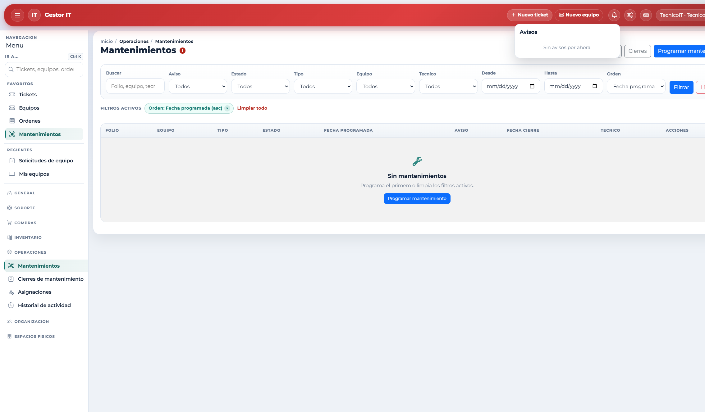

# 7. Inicio, calendario y avisos

Inicio es el tablero del día. El Usuario ve sobre todo lo propio. Técnico IT y Administrador ven el panorama de la operación: tickets fuera de tiempo, sin seguimiento, mantenimientos, solicitudes y stock bajo.

- El calendario de Inicio concentra fechas de tickets (referencia de SLA), próximos checks y mantenimientos.
- Cada aviso de la campana abre el listado ya filtrado.
- Los conteos del menú pueden tardar menos de un minuto en actualizarse. Si acaba de resolver un caso y el número no baja, actualice la página.
- Los paneles de tickets, inventario, consumibles y mantenimiento profundizan lo que Inicio resume.
- Los avisos no llegan por correo: se consultan en Inicio, campana, menú y paneles.
