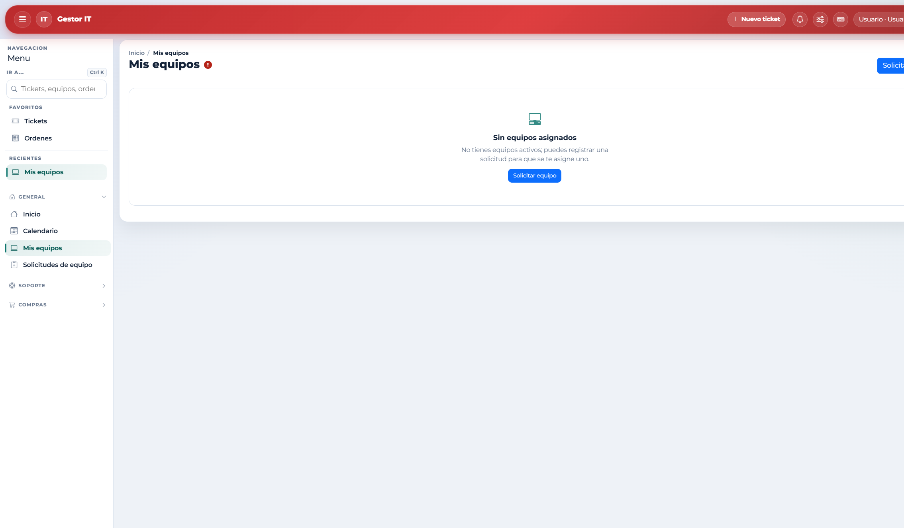
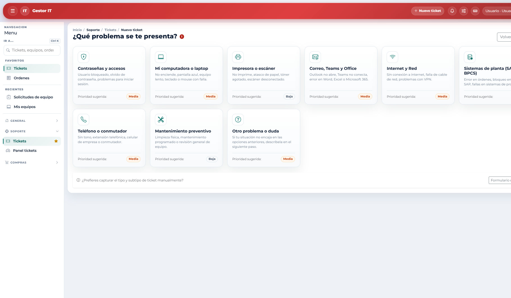
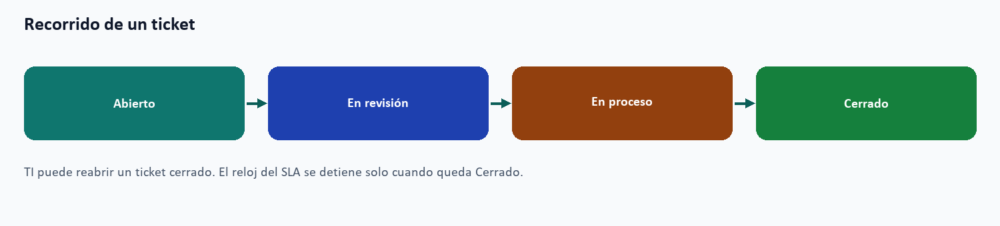
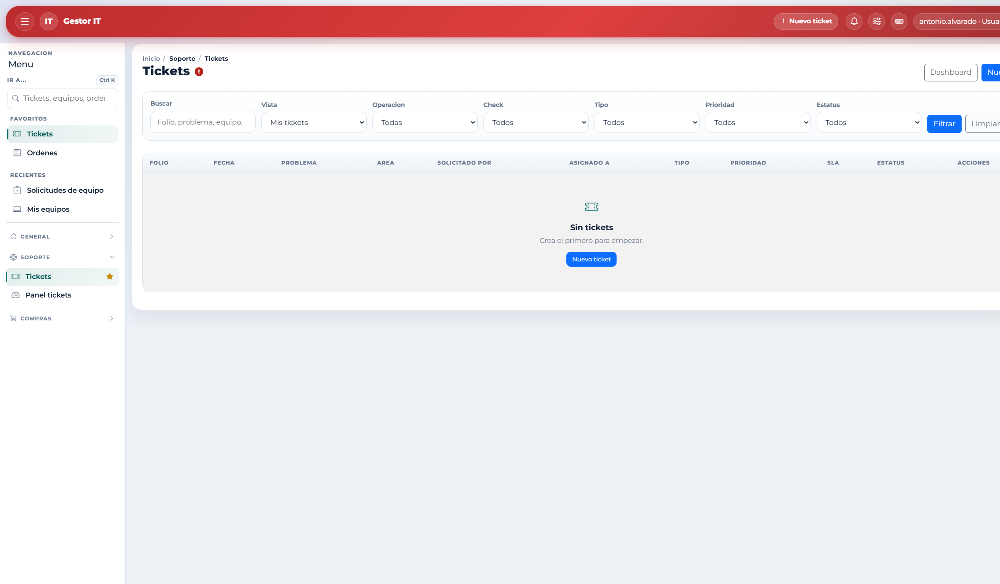
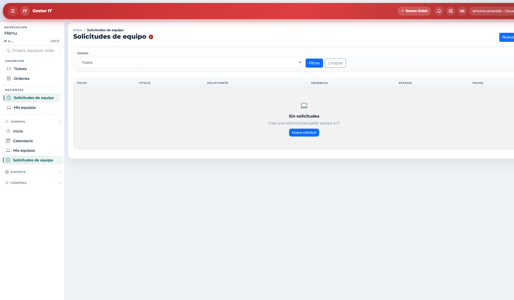
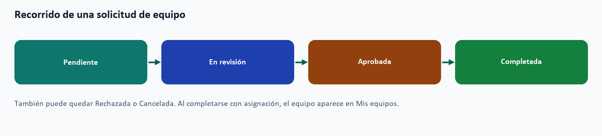
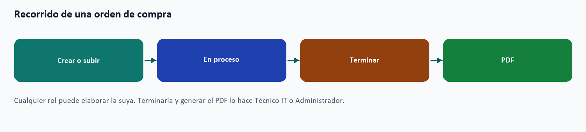

# 8. Tareas de cualquier persona con cuenta

Estas tareas están disponibles para Usuario, Técnico IT y Administrador. El alcance de lo que se ve (lo propio o todo) cambia con el rol.

## 8.1 Consultar mis equipos

1. Abra General / Mis equipos.
2. Revise las asignaciones activas y los periféricos del kit.
3. Abra el detalle de un equipo propio. La consulta es de solo lectura para el rol Usuario.

Si la lista está vacía, no hay una asignación activa o la cuenta no está vinculada a una ficha de Personal. Un Usuario no abre el detalle de un equipo de otra persona. Desde esta pantalla puede ir a **Solicitar equipo**.

## 8.2 Reportar una falla

1. Entre a Soporte / Tickets, o use Nuevo ticket en el encabezado.
2. Si aparece el selector de problemas, elija el más cercano. También puede usar el modo manual (Formulario detallado).
3. Describa el requerimiento. Indique tipo y prioridad. Si la falla es de un equipo suyo, asócielo.
4. Guarde. El sistema asigna un folio (empieza por SPR0-) y abre el detalle.
5. Conserve el folio. Desde el detalle puede agregar comentarios o adjuntos mientras el caso siga abierto.

**Prioridad y un solo ticket por problema.** En el selector, el sistema sugiere la prioridad según el tipo de falla. Usted puede cambiarla si la situación lo requiere, y TI puede reclasificarla al revisar el caso. Use un ticket por problema. Un ticket de tipo mantenimiento pide ayuda por mesa de ayuda; no crea por sí solo la orden formal de mantenimiento.

El solicitante edita su ticket solo si está Abierto y todavía no tiene seguimientos. Cuando TI carga el primer check, el texto queda en el flujo de atención.

## 8.3 Comentar y adjuntar evidencia

- El comentario sirve para fotos, PDF o una aclaración. No sustituye el check con el que TI cierra el caso.
- El solicitante comenta en sus tickets abiertos.
- El personal de TI puede comentar también en tickets cerrados.
- Eliminar un comentario pide confirmación. Lo hace el autor o un Administrador, según el permiso de esa pantalla.

## 8.4 Pedir un equipo

1. Abra General / Solicitudes de equipo y cree una nueva.
2. Escriba título, justificación y urgencia (Baja, Media o Alta).
3. Guarde y conserve el folio (empieza por SOL-).
4. En el detalle verá las notas y la decisión de TI.
5. Puede cancelarla mientras el estado aún lo permita. Una solicitud completada o cerrada ya no se cancela.
6. Si TI la completa con una asignación, el equipo aparece en Mis equipos.

## 8.5 Elaborar una orden de compra

1. Abra Compras / Órdenes y elija nueva.
2. Decida si la crea en el sistema o si sube un archivo que ya existe.
3. Capture proveedor, condiciones y líneas, o el archivo.
4. Guarde. El folio de la orden empieza por OC-.

El rol Usuario ve y sigue las órdenes que él elaboró. No puede terminarlas. Técnico IT y Administrador ven todas y son quienes las terminan para generar el PDF.
