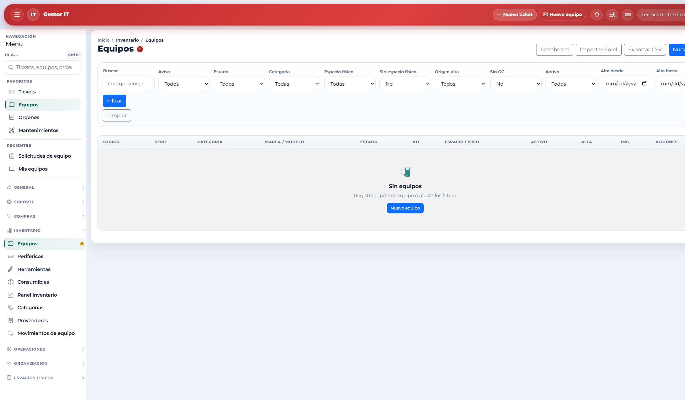
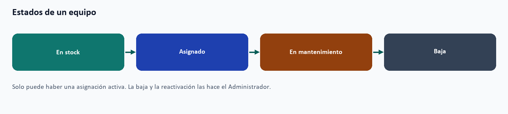
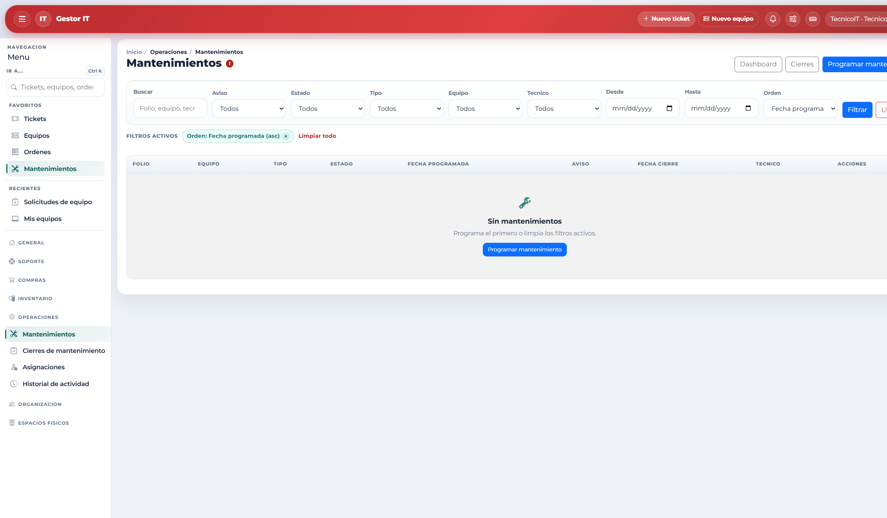
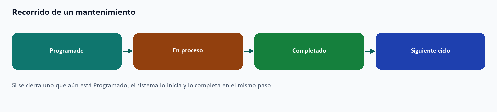

# 9. Operación diaria de TI

Este capítulo es para Técnico IT y también para el Administrador, que puede hacer las mismas tareas de piso. El Técnico no administra roles, plantillas, matriz de permisos ni el archivado del historial, y no elimina tickets ni da de baja equipos.

## 9.1 Rutina sugerida

1. Abra Inicio y la campana: SLA, tickets sin check, mantenimientos, solicitudes y stock bajo.
2. Atienda Tickets, filtrando vencidos o asignados a usted.
3. Registre checks y cierre lo que ya tenga solución.
4. Revise las solicitudes de equipo pendientes.
5. Avance los mantenimientos programados o en proceso.
6. Registre entradas o salidas de consumibles si hubo movimiento.
7. Deje al día ubicaciones y asignaciones.

## 9.2 Atender tickets

1. Abra el listado completo. Filtre por SLA, por asignación o por tickets sin seguimiento.
2. Marque En revisión cuando tome el caso.
3. Agregue un check con avance, pendiente, próximo paso y solución.
4. Un check concluido con solución cierra el ticket y lo deja en Cerrado. Sin solución, el sistema no guarda ese cierre.
5. Si el caso vuelve, use Reabrir. El ticket regresa a En proceso. El motivo es opcional.

Los checks también se consultan en Soporte / Checks. Las fechas de próximo seguimiento generan aviso cuando se acercan o se vencen. Eliminar un ticket o un check es exclusivo del Administrador. El ticket solo se elimina si no tiene seguimientos.

La bitácora (folio BIT-) registra situaciones internas de TI. Las respuestas se asocian a esa bitácora. No reemplazan el ticket que abrió el empleado.

## 9.3 Cobertura de tickets

Cuando un técnico se ausenta, Soporte / Cobertura de tickets delega sus casos a un suplente. Durante las fechas de la cobertura, esos tickets cuentan para quien cubre. El Técnico crea o edita las coberturas en las que participa (ausente, suplente o creador). El Administrador ve todas. No puede haber dos coberturas activas del mismo ausente en fechas que se encimen.

## 9.4 Inventario de equipos

- Equipos, Periféricos y Herramientas son listados distintos. Use la categoría correcta al dar de alta.
- La herramienta de taller no se asigna a una persona como se asigna una laptop.
- El periférico puede vincularse a un equipo padre y forma su kit. También se puede reemplazar o desvincular.
- Cambiar la ubicación deja un movimiento. El historial de movimientos se consulta en Movimientos de equipo.
- Asignar y devolver se hace sobre personal activo. Solo hay una asignación activa por equipo. La asignación puede quedar Activa, Devuelta o Extraviada.
- El alta puede originarse en una compra (con orden), un legado, una donación, una transferencia u otro origen.
- Dar de baja, reactivar o eliminar un equipo corresponde al Administrador, cuando las reglas de la pantalla lo permiten.

Panel inventario resume avisos: equipos sin ubicación, mantenimientos largos y asignaciones antiguas. Categorías y Proveedores son catálogos de apoyo.

## 9.5 Consumibles

Inventario / Consumibles controla productos por cantidad, con SKU y unidad. Los movimientos son Entrada, Salida y Ajuste. Respete el tipo que ofrece la pantalla. El panel y el número del menú avisan stock bajo o agotado. Un consumible no se trata como una pieza con serie.

## 9.6 Mantenimiento

1. Programe el mantenimiento en Operaciones / Mantenimientos. El tipo es Preventivo, Correctivo o Predictivo.
2. Inícielo cuando empiece el trabajo.
3. Registre el cierre en Cierres de mantenimiento: acciones realizadas y fechas.
4. Indique la próxima fecha si corresponde el siguiente ciclo.

También se puede cerrar un mantenimiento que sigue en Programado: el sistema lo inicia y lo completa en ese mismo flujo, y deja el trabajo registrado. El estado Cancelado se usa cuando el trabajo no se va a ejecutar.

## 9.7 Terminar una orden de compra

1. Abra la orden. Confirme proveedor, líneas y condiciones.
2. Use Terminar cuando la orden lo permita. El sistema genera el PDF con la plantilla configurada.
3. Una orden terminada puede usarse después al dar de alta equipos contra sus líneas.

Los estados de la orden son Borrador, En proceso, Terminado y Cancelado. El sistema bloquea borrados que dejarían inconsistente una orden terminada o ya ligada a equipos.

## 9.8 Catálogos, organización y sedes

- Departamentos, puestos, edificios, zonas, ubicaciones, categorías y proveedores se crean y editan desde su listado.
- El mapa de sedes (Espacios físicos) muestra edificio, zona y ubicación, y desde ahí se mantiene el catálogo de espacios.
- Personal se consulta en operación. Crear personas, vincular cuentas y cambiar roles es del Administrador.
- Eliminar un registro de catálogo es del Administrador.

## 9.9 Historial de actividad

Operaciones / Historial de actividad muestra quién hizo qué, en qué módulo y cuándo. Sirve para auditoría. Se puede filtrar. Complementa el detalle del ticket, del equipo o de la orden.
