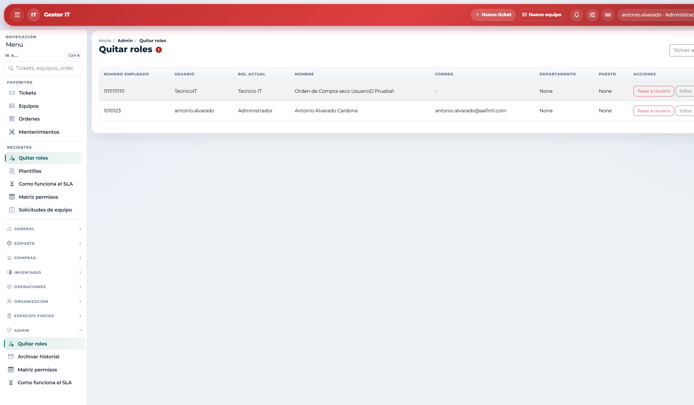
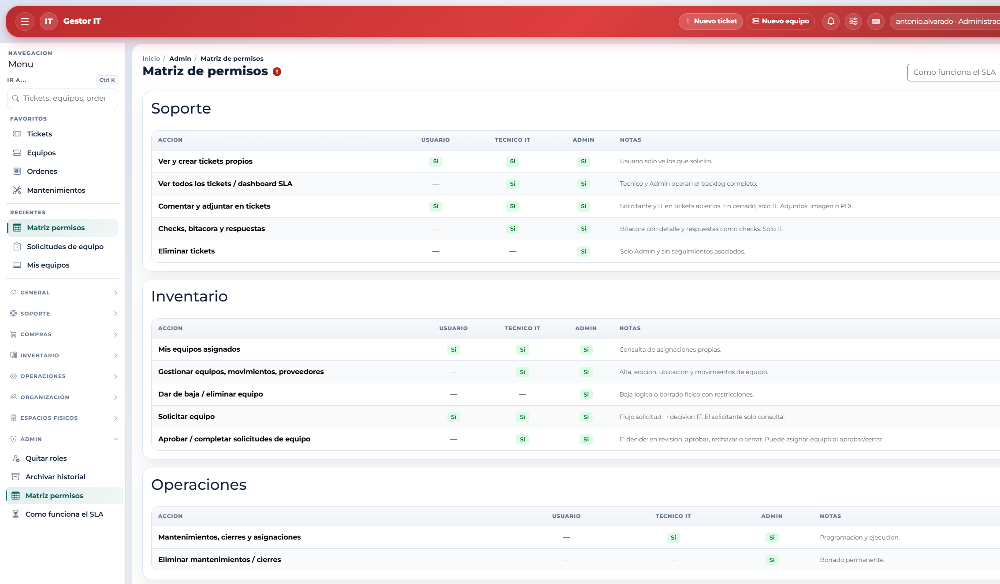
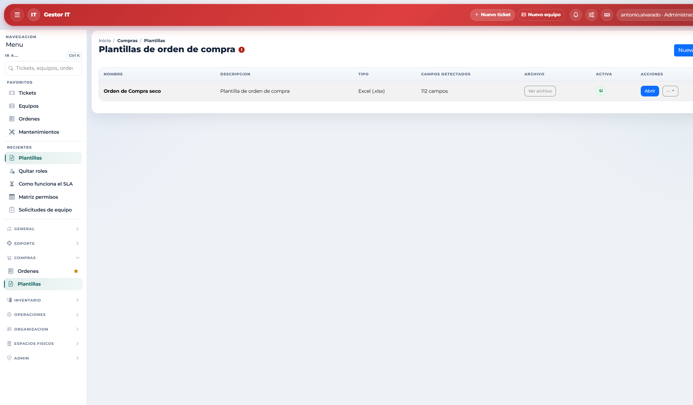

# 10. Gobierno del sistema

Gobierno es administrar el sistema: quién entra, con qué rol, qué se puede borrar y cuánto tiempo se conserva el historial. Lo ejerce el Administrador. El Técnico participa en la parte operativa (coberturas y revisión de solicitudes).

## 10.1 Alta de personas y cuentas

1. Cree o edite Organización / Personal: número de empleado, datos, departamento y puesto.
2. Vincule una cuenta existente o cree la cuenta de acceso.
3. Asigne el rol: Usuario, Técnico IT o Administrador.
4. Entregue las credenciales por un canal seguro.

Al eliminar una ficha de Personal se liberan los equipos asignados y la cuenta vinculada queda inactiva. La cuenta no se borra solo por quitar la ficha, y el historial asociado se conserva.

## 10.2 Acciones reservadas al Administrador

| Dónde | Qué puede hacer |
|-------|-----------------|
| Tickets | Eliminar un ticket sin seguimientos y eliminar checks. |
| Inventario | Dar de baja, reactivar o eliminar un equipo cuando la pantalla lo permite. |
| Compras / Plantillas | Subir y editar plantillas DOCX, XLSX o PDF antes de usarlas en órdenes reales. |
| Catálogos | Eliminar departamentos, puestos, categorías, proveedores y espacios. |
| Admin / Quitar roles | Bajar a Usuario a técnicos o administradores, en bloque. |
| Admin / Archivar historial | Archivar y, según la política, purgar el historial de actividad. |
| Admin / Matriz permisos | Consultar la tabla de capacidades. No cambia los permisos: el rol se asigna en Personal. |
| Admin / Cómo funciona el SLA | Leer la regla de tiempos, el aviso de por vencer y los ejemplos de prioridad. |

**Antes de borrar.** Prefiera la baja del equipo o desactivar a la persona cuando con eso baste. Asigne Técnico IT solo a quien opera TI y revise de vez en cuando las cuentas con rol elevado. No comparta la cuenta de Administrador. Verifique las plantillas antes de terminar órdenes en serie.

El acceso al panel de administración de Django es aparte: hace falta el privilegio de personal de la plataforma, no solo el rol Administrador de esta aplicación. Tener esa marca técnica sin el grupo Administrador no otorga el gobierno de Gestor IT.
