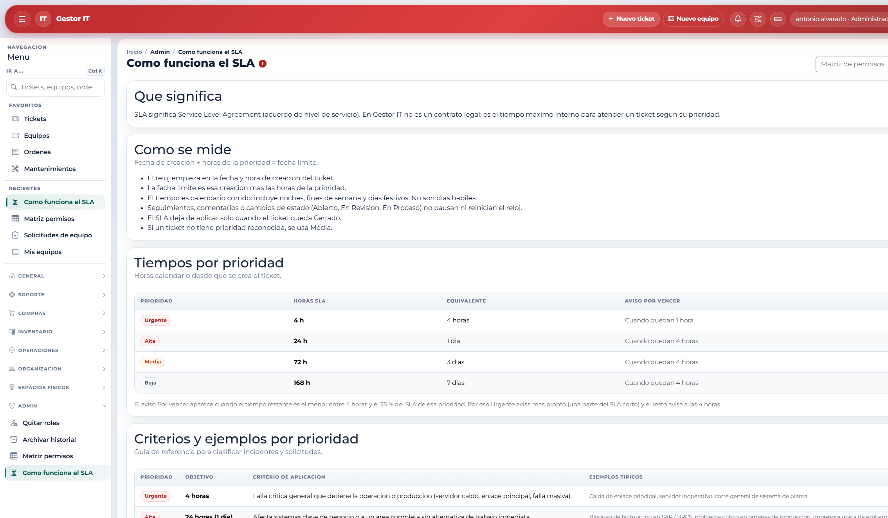

# 12. Tiempos de atención (SLA)

SLA, en esta aplicación, es el tiempo máximo interno para atender un ticket según su prioridad. No es un contrato. El reloj empieza en la fecha y hora en que se crea el ticket y usa tiempo de calendario corrido: incluye noches, fines de semana y días festivos.

- Seguimientos, comentarios y los estados Abierto, En revisión o En proceso no pausan ni reinician el reloj.
- El SLA deja de contarse solo cuando el ticket queda Cerrado.
- Si la prioridad no se reconoce, se usa Media.
- En tiempo: sigue abierto y aún no entra al aviso.
- Por vencer: sigue abierto y ya está en la ventana de aviso (lo que ocurra antes entre 4 horas y el 25 % del plazo).
- Vencido: sigue abierto y ya pasó el plazo de su prioridad.

| Prioridad | Plazo | Cuándo usarla |
|-----------|-------|----------------|
| Urgente | 4 horas | Falla crítica que detiene la operación o la producción. |
| Alta | 24 horas | Sistema clave o un área completa, sin alternativa inmediata. |
| Media | 72 horas | Afecta el puesto de una persona y no detiene la operación global. |
| Baja | 7 días | Se puede programar, o existe una alternativa para seguir trabajando. |
